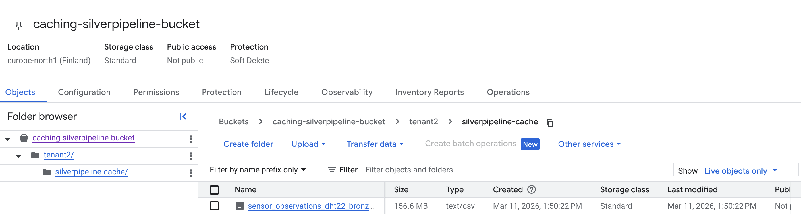
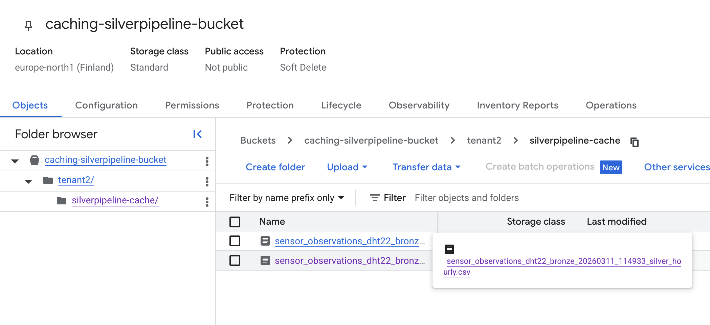
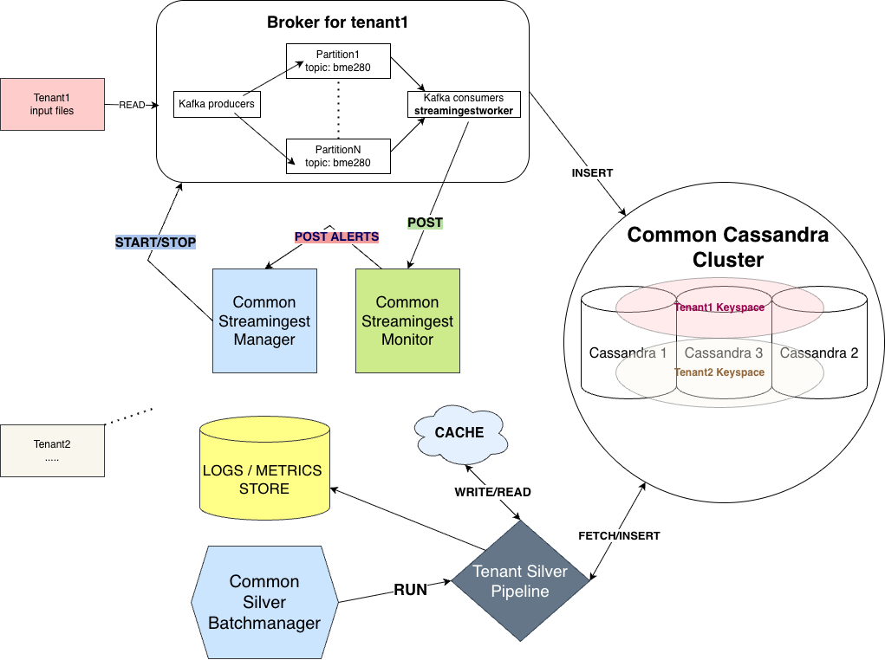

# Assignment 2 Report

**AI Usage Disclosure**:
>I declare that I have not used AI for writing the assignment report\
>I declare that I have used VSCode Copilot for code generation.


## Part 1
### 1.

**Messaging system** : I used Apache Kafka for near real-time ingestion. 

**Why Kafka?** The protocol it uses is optimized for high throughput, low latency, and efficient message "batching", which is ideal for a giant dataset that needs to be delivered at once. It gives a lot of integrated features that makes parallelism possible, so that I am able to use to the maximum capacity my resources (since for the first assignment everything runs on my local computer). The Kafka partitioning feature ties nicely with the Cassandra integrated partitioning, so when a consumer tries to insert a batch I am guaranteed that all datasamples will be in the same partition. (Kafka is partitioned by sensor_id and Cassandra partitions data by hour and then by sensor_id).

The design is as follows: each tenant provides a .csv big data file daily with weather measurment records. In my experiment **tenant1** uses BME280 sensor records and **tenant2** uses DHT22 sensor records, which have different formats. 

Both tenants can ingest independently by running separate Kafka brokers, with tenant-specific source files and parsing rules defined in [tenant_configs/*.json](../code/tenant_configs).

In the current setup, each tenant can also use a different CSV structure and source file through [tenant_configs/*.json](../code/tenant_configs).


```Example tenant1 data:```
|sensor_id|sensor_type|location|lat|lon|timestamp|pressure|altitude|pressure_sealevel|temperature|humidity|
|---|---|---|---|---|---|---|---|---|---|---|
|113|BME280|45999|48.808|9.182|2025-01-01T01:13:29|99112.75|||-1.80|100.00|


``Example tenant2 data:``
|sensor_id|sensor_type|location|lat|lon|timestamp|temperature|humidity|
|---|---|---|---|---|---|---|---|
|36474|DHT22|81266|53.248|-6.124|2025-06-01T00:00:00|13.00|99.90|


**Multi-tenancy model** : All tenants will share the same Cassandra cluster, where each tenant *X* has its own keyspace named *mysimbdp_tenantX*. This way, it is easy for mysimpbdp to add and remove tenants based on the principle of pay-per-use for the following reasons:
 - *Rapid Provisioning (Onboarding)*: Adding a new tenant consists in only a CREATE KEYSPACE command. Since the infrastructure (the Cassandra cluster) is already running, there is no need for new containers / virtual machines / new software for every new customer.
 - *Granular Resource Management*: Cassandra allows configurations at the keyspace level. You can use Replication Factors to offer different service tiers, like for example a *gold* tenant might pay more for a replication factor of 3, while a *bronze* tenant pays less for a replication factor of 1.
 - *Instant Decommissioning (Offboarding)*: If a tenant stops paying, you can remove their entire footprint—data, schemas,  using a DROP KEYSPACE command.
 - *Simplified Monitoring and Billing*: By separating data into keyspaces, you can easily track storage metrics per keyspace. This allows you to bill tenants accurately based on the actual disk space or throughput they consume.


### 2.

**mysimbdp-streamingestmanager** : it is a control plane that orchestrates Docker Compose services for multiple tenants. It can start/stop tenant specific **streamingestworker**s. It does not do any ingesting itself.

The tenant topology is hardcoded in a tenant registry map:

```json
"tenant1": {
		TenantID:          "tenant1",
		Zookeeper:         "zookeeper-tenant1",
		Kafka:             "kafka-tenant1",
		WorkerService:     "tenant1-streamingestworker",
		SourceService:     "tenant1-source",
		KafkaTopic:        "bme280-measurements",
		CassandraKeyspace: "mysimbdp_tenant1",
		SchemaProfile:     "bme280",
	},
```

The manager parses flags and executes the following commands:
- start:
    - resolves tenant(s) 
    - number of workers
    - number of kafka partitions
    - prepares chunks from the original data (splitting for efficient producer reads according to the number of workers chosen)
    - creates tenant keyspace if not already available
    - ensures kafka topic is available
    - creates kafka topic partitions 
- stop:
    - stops and removes worker containers (kafka consumers)
    - if stop-source=true also stops and removes source (kafka producers)
    - if stop-broker=true also stops and removes kafka broker 
    - it does not drop keyspaces or data from the Cassandra cluster, it only handles ingestion workers
- status:
    - can specify which tenant status by --tenant flag
    - shows tenant's stack, magager, monitor
- listen-alerts:
    - runs a HTTP server that recieves alerts from ```streamingestmonitor```

The manager only runs compose commands, the tenant specific details are a **blackbox** for it. They are handled as environment variables, which are fetched from the tenant configuration files.

**What does the tenant have to do for *streamingestworker***:
 - A tenant provides a configuration JSON file, that will be used by the default Kafka producer and consumer internal for mysimpbdp. The information will be read by Kafka producers and consumers, so the keyspace, tablename, data schema, data source location, Cassandra partion key, etc. will be inserted into the default ingestion workers.

- Kafka `consumer.go` no longer has tenant-specific hardcoded insert statements. It now builds `CREATE TABLE` and `INSERT` CQL directly from each tenant JSON schema.


Here is an example of the .json configuration file for ingestion:
```json
{
  "tenant_id": "tenant1",
  "schema_profile": "bme280",
  "table_prefix": "sensor_measurements",
  "csv_format": "bme280_full",
  "source_csv": "/data/tenant1/2025-06-01_bme280.csv",
  "source_chunk_dir": "/data/tenant1/chunks",
  "schema": {
    "table_suffix_field": "sensor_type",
    "columns": [
      { "name": "sensor_id", "type": "int", "field": "sensor_id" },
      { "name": "sensor_type", "type": "text", "field": "sensor_type" },
      { "name": "location", "type": "float", "field": "location" },
      { "name": "lat", "type": "float", "field": "lat" },
      { "name": "lon", "type": "float", "field": "lon" },
      { "name": "day", "type": "text", "field": "day" },
      { "name": "hour", "type": "int", "field": "hour" },
      { "name": "timestamp", "type": "text", "field": "timestamp" },
      { "name": "pressure", "type": "float", "field": "pressure" },
      { "name": "altitude", "type": "float", "field": "altitude" },
      { "name": "pressure_sealevel", "type": "float", "field": "pressure_sealevel" },
      { "name": "temperature", "type": "float", "field": "temperature" },
      { "name": "humidity", "type": "float", "field": "humidity" }
    ],
    "primary_key": {
      "partition": ["day", "hour"],
      "clustering": ["sensor_id", "timestamp"]
    }
  }
}
```

### 3.

**WARNING** The minimum throughput expected by the monitor is set very high, so that the alerting can be observed for testing purposes. In reality, it would be set according to the expected throughput, so about minimum 2000 messages per Kafka producer.

#### Performance Report (Scenario 1): Underprovisioning vs normal run

Description: The normal run has 10 concurrent workers, 10 Kafka partitions. The underprovisioned run has 1 worker and 1 partition. They are both left to run for a total of 120 seconds.

Comparison target:
- baseline: [code/benchmark_results/underprovisioned_short_120s](../code/benchmark_results/underprovisioned_short_120s)
- chunked multi-source: [code/benchmark_results/normal_short_120s](../code/benchmark_results/normal_short_120s)

Summary (both tenants combined):

| scenario | reports_received | alerts_forwarded | alert_ratio_pct | total_ingested_mb | total_avg_throughput_rps_sum | producer_rows | inserted_rows | processing_pct | total_final_kafka_lag | insert_exceptions |
|---|---:|---:|---:|---:|---:|---:|---:|---:|---:|---:|
| underprovisioned_short_120s | 43 | 22 | 51.16 | 503.7340 | 10181.32 | 5002944 | 2273998 | 45.45 | 2966269 | 0 |
| chunked_10workers_10sources_rerun | 189 | 23 | 12.17 | 1077.6729 | 50676.30 | 5002944 | 4992427 | 99.79 | 0 | 41 |

Per-tenant details:

| scenario | tenant | avg_throughput_rps | total_avg_throughput_rps (`WORKERS * avg_throughput_rps`) | avg_ingested_mb_per_sec | total_ingested_mb | producer_rows | inserted_rows | processing_pct | final_kafka_lag | drain_status | insert_exceptions | duplicate_rows |
|---|---|---:|---:|---:|---:|---:|---:|---:|---:|---|---:|---:|
| underprovisioned_short_120s | tenant1 | 4613.15 | 4613.15 | 1.0810 | 237.8819 | 2914834 | 1063048 | 36.47 | 2070359 | timeout | 0 | 3137 |
| underprovisioned_short_120s | tenant2 | 5568.17 | 5568.17 | 1.2641 | 265.8521 | 2088110 | 1210950 | 57.99 | 895910 | timeout | 0 | 840 |
| chunked_10workers_10sources_rerun | tenant1 | 2258.86 | 22588.60 | 0.5309 | 643.2399 | 2914834 | 2911539 | 99.89 | 0 | drained | 8 | 3137 |
| chunked_10workers_10sources_rerun | tenant2 | 2808.77 | 28087.70 | 0.6384 | 434.4330 | 2088110 | 2080888 | 99.65 | 0 | drained | 33 | 840 |

Observations:
- The normal run, with 10 workers and chunked file reading produced all available rows (`5002944` produced rows) while also draining Kafka completely (`final lag = 0` for both tenants), meaning the number of parallel workers/broker (or per tenant) was enough to drain all produced messages in under 2 minutes. However, the underprovisioned run did not fully insert data into the database in the allocated time, even with additional draining buffer. The underprovisioned run also produced all the messages, but failed to consume them in under 2 minutes.
- Total average throughput is reported as `WORKERS * avg_throughput_rps`: baseline uses `WORKERS=1` (same as average throughput), rerun uses `WORKERS=10`.
- Processing fraction improved from `45.45%` to `99.79%` when each source replica (each kafka producer) read a different chunk file. This means the fraction of inserted messages out of the total produced messages. The lacking 0.21% comes from duplicate rows in the input cvs files, which can be seen in the last column of the above table.
- `total_ingested_mb` increased from `503.7340` to `1077.6729` in the same 120s benchmark window, indicating much higher effective ingestion completion for the normal run than the underprovisioned one.
- Trade-off: insert exceptions increased (`0` -> `41`). In the underprovisioned run there is only one worker/tenant that starts, after which ingestion begins, this is a low parallelism envirionment and no exceptions appear. However, in the 10 worker/tenant run, an environment with a lot of threads, we can see that not all workers are started early enough, so there are a few retries untill all of them succesfully start ingesting. Exception logs file can be seen in [worker_insert_exceptions_by_tenant.txt](../code/benchmark_results/normal_short_120s/worker_insert_exceptions_by_tenant.txt).


#### Performance Report (Scenario 2) - Cassandra Write-Limit `5ms` vs `20ms` vs `50ms`

Description: In this scenario I have set 1 worker and 1 partition, while throttling the Cassandra writes via an artificial sleep between ingesting batches (CASSANDRA_WRITE_SLEEP_MS). This scenario simulates an intensive ingestion workload where incoming data rate significantly exceeds the processing capability of the ingestion pipeline.

Source folders:
- [write_limit_5ms](../code/benchmark_results/write_limit_5ms_20260310_163743)
- [write_limit_20ms](../code/benchmark_results/write_limit_20ms_20260310_163743)
- [write_limit_50ms](../code/benchmark_results/write_limit_50ms_20260310_163743)


Combined summary (both tenants):

| sleep_ms | reports_received | alerts_forwarded | alert_ratio_pct | total_avg_throughput_rps | total_avg_ingested_mb_per_sec | total_ingested_mb | producer_rows | inserted_rows | processing_pct | total_final_kafka_lag |
|---:|---:|---:|---:|---:|---:|---:|---:|---:|---:|---:|
| 5 | 46 | 23 | 50.00 | 3395.15 | 0.7818 | 179.5148 | 5002944 | 807865 | 16.15 | 4282518 |
| 20 | 46 | 23 | 50.00 | 1652.26 | 0.3807 | 87.6100 | 5002944 | 384581 | 7.69 | 4663719 |
| 50 | 46 | 23 | 50.00 | 789.36 | 0.1819 | 41.9373 | 5002944 | 184928 | 3.70 | 4840194 |

Per-tenant details:

| sleep_ms | tenant | avg_throughput_rps | avg_ingested_mb_per_sec | total_ingested_mb | producer_rows | inserted_rows | processing_pct | final_kafka_lag | drain_status | insert_exceptions | duplicate_rows |
|---:|---|---:|---:|---:|---:|---:|---:|---:|---|---:|---:|
| 5 | tenant1 | 1574.76 | 0.3689 | 88.6252 | 2914834 | 392325 | 13.46 | 2603184 | timeout | 0 | 3137 |
| 5 | tenant2 | 1820.39 | 0.4129 | 90.8896 | 2088110 | 415540 | 19.90 | 1679334 | timeout | 0 | 840 |
| 20 | tenant1 | 790.02 | 0.1851 | 44.4771 | 2914834 | 192119 | 6.59 | 2765284 | timeout | 0 | 3137 |
| 20 | tenant2 | 862.24 | 0.1956 | 43.1329 | 2088110 | 192462 | 9.22 | 1898435 | timeout | 0 | 840 |
| 50 | tenant1 | 385.14 | 0.0902 | 21.7181 | 2914834 | 94369 | 3.24 | 2841509 | timeout | 0 | 3137 |
| 50 | tenant2 | 404.22 | 0.0917 | 20.2192 | 2088110 | 90559 | 4.34 | 1998685 | timeout | 0 | 840 |

Observations:
- Increasing `CASSANDRA_WRITE_SLEEP_MS` from `5` to `20` to `50` reduced throughput and processed fraction, while increasing the Kafka lag (messages produced but not consumed).
- Insert exceptions stayed at `0` in all three runs, matching the behaviour of the underprovisioned run from the previous scenario, where we also had 1 worker, but had 0s Cassandra write sleep.
- All three runs timed out during drain due to intentionally high offered load and short runtime.

The results demonstrate that under a heavy ingestion workload, the processing capacity of streamingestworker becomes limited by the downstream Cassandra write latency, resulting in reduced throughput, increasing Kafka backlog, and a low fraction of processed records.

### 4.
**mysimbdp-streamingestmonitor**: is a HTTP service that recieves worker performanec reports and forwards alerts to **streamingestmanager** when necessary.

A report format would look like this:
```go
type workerPerformanceReport struct {
	TenantID                string  `json:"tenant_id"`
	WorkerID                string  `json:"worker_id"`
	KafkaTopic              string  `json:"kafka_topic"`
	ReportedAt              string  `json:"reported_at"`
	WindowSeconds           float64 `json:"window_seconds"`
	RecordsInWindow         int     `json:"records_in_window"`
	BatchesInWindow         int     `json:"batches_in_window"`
	AvgBatchIngestMS        float64 `json:"avg_batch_ingest_ms"`
  ThroughputRecordsPerSec float64 `json:"throughput_records_per_sec"`
  IngestedMBInWindow      float64 `json:"ingested_mb_in_window"`
  IngestedMBPerSec        float64 `json:"ingested_mb_per_sec"`
  TotalIngestedMB         float64 `json:"total_ingested_mb"`
	TotalInserted           int     `json:"total_inserted"`
	TotalConsumed           int     `json:"total_consumed"`
}
```

I also designed a **cooldown system**. When an alert is sent, then there is a coodown period before any other alert is sent to the manager, to prevent useless spamming.

**mysimbdp-streamingestmonitor** has the following configuration:
- MONITOR_LISTEN_ADDR - default 8081
- MANAGER_ALERT_URL - default http://streamingestmanager:8082/alerts
- MONITOR_MIN_THROUGHPUT_RPS - default 300
- MONITOR_MAX_AVG_BATCH_INGEST_MS - default 250
- MONITOR_ALERT_COOLDOWN_SECONDS - default 30

**mysimbdp-streamingestmonitor** has the following endpoints:
- GET /healthz : returns 200 ok for health checks
- POST /reports: reports worker performance:
    - tenant ID
    - worker ID
    - ThroughputRecordsPerSec
    - AvgBatchIngestMS
    - IngestedMBInWindow
    - TotalIngestedMB
    - WindowSeconds
    - RecordsInWindow
    - When there is a reason to alert the manager (small throughput and/or small average batch ingest), it first checks it is not in a cooldown period, in which case the alert is skipped. If it is not in a cooldown period, it sends the alert in json format via HTTP.


### 5.

The **mysimbdp-streamingestmonitor** is implemented in [streamingestmonitor.go](../code/streamingestmonitor.go).
There, the function *evaluateThresholds* recieves the worker performance and returns a list of possible alert reasons. If the list is empty, then the workers are under normal parameters. The reasons that can be added to the list are : minimum ingestion throughput not met, exceeded average batch ingest.

As explained in the previous point, the **mysimbdp-streamingestmonitor** sends HTTP messages to **streamingestmanager**.

```Demonstrate these features.```
All the logs can be further analysed in [code/benchmark_results](../code/benchmark_results).

Here is an extract from [log_streamingestmanager.txt](../code/benchmark_results/good_test/log_streamingestmanager.txt). What we can observe is that in the beginning 0 throughput is reported, because the ingestion didn't fully have time to start yet.


```sh
streamingestmanager  | monitor alert received: tenant=tenant1 worker=75a23c80f655 severity=warning reasons=throughput 0.00 rps below minimum 1000000.00 rps throughput=0.00 avg_batch_ms=0.00 window_mb=0.0000 total_mb=0.0000

streamingestmanager  | monitor alert received: tenant=tenant1 worker=97111007d5e8 severity=warning reasons=throughput 0.00 rps below minimum 1000000.00 rps throughput=0.00 avg_batch_ms=0.00 window_mb=0.0000 total_mb=0.0000

streamingestmanager  | monitor alert received: tenant=tenant1 worker=08c6673c5656 severity=warning reasons=throughput 0.00 rps below minimum 1000000.00 rps throughput=0.00 avg_batch_ms=0.00 window_mb=0.0000 total_mb=0.0000

streamingestmanager  | monitor alert received: tenant=tenant2 worker=bda42625c2f8 severity=warning reasons=throughput 0.00 rps below minimum 1000000.00 rps throughput=0.00 avg_batch_ms=0.00 window_mb=0.0000 total_mb=0.0000

streamingestmanager  | monitor alert received: tenant=tenant2 worker=6bddf94b63d7 severity=warning reasons=throughput 0.00 rps below minimum 1000000.00 rps throughput=0.00 avg_batch_ms=0.00 window_mb=0.0000 total_mb=0.0000

streamingestmanager  | monitor alert received: tenant=tenant1 worker=63c34b5a4948 severity=warning reasons=throughput 889.06 rps below minimum 1000000.00 rps throughput=889.06 avg_batch_ms=5.81 window_mb=2.1471 total_mb=4.9553

streamingestmanager  | monitor alert received: tenant=tenant1 worker=97111007d5e8 severity=warning reasons=throughput 1933.15 rps below minimum 1000000.00 rps throughput=1933.15 avg_batch_ms=5.67 window_mb=4.6833 total_mb=10.8362

streamingestmanager  | monitor alert received: tenant=tenant1 worker=75a23c80f655 severity=warning reasons=throughput 940.30 rps below minimum 1000000.00 rps throughput=940.30 avg_batch_ms=5.79 window_mb=2.2819 total_mb=5.3147

streamingestmanager  | monitor alert received: tenant=tenant1 worker=08c6673c5656 severity=warning reasons=throughput 891.47 rps below minimum 1000000.00 rps throughput=891.47 avg_batch_ms=5.85 window_mb=2.1601 total_mb=5.0169

streamingestmanager  | monitor alert received: tenant=tenant2 worker=2ff91db36b9c severity=warning reasons=throughput 2759.26 rps below minimum 1000000.00 rps throughput=2759.26 avg_batch_ms=3.46 window_mb=6.2830 total_mb=13.9587
```

And here is an extract of logs from [log_streamingestmonitor.txt](../code/benchmark_results/good_test/log_streamingestmonitor.txt). Again, we observe in the beginning the startup process, no records had time to be inserted yet and the monitor reports 0 records inserted.
```sh
streamingestmonitor  | 2026/03/10 12:42:37 report received: tenant=tenant1 worker=08c6673c5656 throughput=0.00 rps avg_batch_ms=0.00 window=10.5s records=0 window_mb=0.0000 total_mb=0.0000 mbps=0.0000

streamingestmonitor  | 2026/03/10 12:42:37 report received: tenant=tenant1 worker=75a23c80f655 throughput=0.00 rps avg_batch_ms=0.00 window=10.7s records=0 window_mb=0.0000 total_mb=0.0000 mbps=0.0000

streamingestmonitor  | 2026/03/10 12:42:37 report received: tenant=tenant1 worker=97111007d5e8 throughput=0.00 rps avg_batch_ms=0.00 window=10.4s records=0 window_mb=0.0000 total_mb=0.0000 mbps=0.0000

streamingestmonitor  | 2026/03/10 12:42:37 alert forwarded: tenant=tenant1 worker=75a23c80f655 reasons=throughput 0.00 rps below minimum 1000000.00 rps

streamingestmonitor  | 2026/03/10 12:42:37 alert forwarded: tenant=tenant1 worker=97111007d5e8 reasons=throughput 0.00 rps below minimum 1000000.00 rps

streamingestmonitor  | 2026/03/10 12:42:37 alert forwarded: tenant=tenant1 worker=08c6673c5656 reasons=throughput 0.00 rps below minimum 1000000.00 rps

streamingestmonitor  | 2026/03/10 12:42:37 report received: tenant=tenant1 worker=63c34b5a4948 throughput=2.49 rps avg_batch_ms=33.00 window=10.0s records=25 window_mb=0.0058 total_mb=0.0058 mbps=0.0006

streamingestmonitor  | 2026/03/10 12:42:37 alert skipped due to cooldown: tenant=tenant1 worker=63c34b5a4948

streamingestmonitor  | 2026/03/10 12:42:37 report received: tenant=tenant1 worker=234820a34f1c throughput=0.00 rps avg_batch_ms=0.00 window=10.5s records=0 window_mb=0.0000 total_mb=0.0000 mbps=0.0000

streamingestmonitor  | 2026/03/10 12:42:37 alert skipped due to cooldown: tenant=tenant1 worker=234820a34f1c

streamingestmonitor  | 2026/03/10 12:42:38 report received: tenant=tenant1 worker=135350cbe6fc throughput=0.00 rps avg_batch_ms=0.00 window=10.3s records=0 window_mb=0.0000 total_mb=0.0000 mbps=0.0000

streamingestmonitor  | 2026/03/10 12:42:38 alert skipped due to cooldown: tenant=tenant1 worker=135350cbe6fc

streamingestmonitor  | 2026/03/10 12:42:38 report received: tenant=tenant1 worker=332a28b8806f throughput=0.00 rps avg_batch_ms=0.00 window=10.2s records=0 window_mb=0.0000 total_mb=0.0000 mbps=0.0000

streamingestmonitor  | 2026/03/10 12:42:38 alert skipped due to cooldown: tenant=tenant1 worker=332a28b8806f

streamingestmonitor  | 2026/03/10 12:42:47 report received: tenant=tenant1 worker=08c6673c5656 throughput=1219.81 rps avg_batch_ms=8.53 window=10.0s records=12200 window_mb=2.8568 total_mb=2.8568 mbps=0.2856

streamingestmonitor  | 2026/03/10 12:42:47 alert skipped due to cooldown: tenant=tenant1 worker=08c6673c5656

streamingestmonitor  | 2026/03/10 12:42:47 report received: tenant=tenant1 worker=97111007d5e8 throughput=2627.05 rps avg_batch_ms=7.36 window=10.0s records=26275 window_mb=6.1529 total_mb=6.1529 mbps=0.6152
```

Then we can also take a look at the errors, which are all gathered in [worker_insert_exceptions_by_tenant.txt](../code/benchmark_results/good_test/worker_insert_exceptions_by_tenant.txt)
```sh
=== tenant=tenant1 service=tenant1-streamingestworker ===
7527:tenant1-streamingestworker-1   | 2026/03/10 12:42:36 Consumer error: failed to insert batch: failed to insert batch into mysimbdp_tenant1.sensor_measurements_bme280_bronze: Operation failed - received 1 responses and 2 failures: INCOMPATIBLE_SCHEMA from /172.19.0.8:7000, INCOMPATIBLE_SCHEMA from /172.19.0.5:7000
8810:tenant1-streamingestworker-9   | 2026/03/10 12:42:36 Consumer error: failed to insert batch: failed to insert batch into mysimbdp_tenant1.sensor_measurements_bme280_bronze: Operation failed - received 1 responses and 2 failures: INCOMPATIBLE_SCHEMA from /172.19.0.8:7000, INCOMPATIBLE_SCHEMA from /172.19.0.5:7000

=== tenant=tenant2 service=tenant2-streamingestworker ===
29:tenant2-streamingestworker-9  | 2026/03/10 12:42:55 Consumer error: failed to insert batch: failed to insert batch into mysimbdp_tenant2.sensor_observations_dht22_bronze: java.lang.IllegalArgumentException: Unknown CF a8a1a960-1c7e-11f1-909f-9bf7b9d39022
55:tenant2-streamingestworker-2  | 2026/03/10 12:42:55 Consumer error: failed to insert batch: failed to insert batch into mysimbdp_tenant2.sensor_observations_dht22_bronze: java.lang.IllegalArgumentException: Unknown CF a8a1a960-1c7e-11f1-909f-9bf7b9d39022
56:tenant2-streamingestworker-3  | 2026/03/10 12:42:55 Consumer error: failed to insert batch: failed to insert batch into mysimbdp_tenant2.sensor_observations_dht22_bronze: java.lang.IllegalArgumentException: Unknown CF a8a1a960-1c7e-11f1-909f-9bf7b9d39022
60:tenant2-streamingestworker-6  | 2026/03/10 12:42:55 Consumer error: failed to insert batch: failed to insert batch into mysimbdp_tenant2.sensor_observations_dht22_bronze: java.lang.IllegalArgumentException: Unknown CF a8a1a960-1c7e-11f1-909f-9bf7b9d39022
111:tenant2-streamingestworker-7  | 2026/03/10 12:42:54 Consumer error: failed to insert batch: failed to insert batch into mysimbdp_tenant2.sensor_observations_dht22_bronze: java.lang.IllegalArgumentException: Unknown CF a8a18250-1c7e-11f1-ac27-7577600549d1
121:tenant2-streamingestworker-10  | 2026/03/10 12:42:55 Consumer error: failed to insert batch: failed to insert batch into mysimbdp_tenant2.sensor_observations_dht22_bronze: java.lang.IllegalArgumentException: Unknown CF a8a1a960-1c7e-11f1-909f-9bf7b9d39022
196:tenant2-streamingestworker-5   | 2026/03/10 12:42:54 Consumer error: failed to insert batch: failed to insert batch into mysimbdp_tenant2.sensor_observations_dht22_bronze: java.lang.IllegalArgumentException: Unknown CF a8a18250-1c7e-11f1-ac27-7577600549d1
```

After taking a look at the first exception, i checked the full stream-ingest worker logs for the first tenant and found that the table did not have time to be created yet, which fixes itself immediatelly, as seen in the extract below: 
```sh
tenant1-streamingestworker-4  | 2026/03/10 12:42:26 managed worker init: tenant=tenant1 topic=bme280-measurements group=tenant1-ingest-group keyspace=mysimbdp_tenant1 brokers=kafka-tenant1:29092
tenant1-streamingestworker-4  | 2026/03/10 12:42:26 Connected to Cassandra cluster with tier policy: tenant=tenant1 tier=gold consistency=QUORUM
tenant1-streamingestworker-4  | 2026/03/10 12:42:26 Tenant schema selected: tenant=tenant1 tier=gold consistency=QUORUM profile=bme280 format=bme280_full table_prefix=sensor_measurements columns=13
tenant1-streamingestworker-4  | 2026/03/10 12:42:26 Cassandra insert retry policy: max_retries=60 base_backoff=500ms max_backoff=10s
tenant1-streamingestworker-4  | 2026/03/10 12:42:26 Monitor reporting enabled: url=http://streamingestmonitor:8081/reports interval=10s worker=75a23c80f655
tenant1-streamingestworker-4  | 2026/03/10 12:42:26 Kafka consumer connected, consuming from topic: bme280-measurements
tenant1-streamingestworker-4  | 2026/03/10 12:42:36 Detected table_suffix_field=sensor_type value=BME280, creating table with profile=bme280: mysimbdp_tenant1.sensor_measurements_bme280_bronze
tenant1-streamingestworker-4  | 2026/03/10 12:42:37 Created table using schema=bme280: mysimbdp_tenant1.sensor_measurements_bme280_bronze
tenant1-streamingestworker-4  | 2026/03/10 12:42:37 Inserted 25 records (total: 25, consumed messages: 25)
tenant1-streamingestworker-4  | 2026/03/10 12:42:37 Inserted 25 records (total: 50, consumed messages: 50)
tenant1-streamingestworker-4  | 2026/03/10 12:42:37 Inserted 25 records (total: 75, consumed messages: 75)
```

A simmiliar exception type happens in tenant2 stream ingest worker logs: a certain worker is not available yet, so the monitor catches and alerts the exceptions, but after startup settles, the exception does not appear anymore.

Overall, the data ingestion system functions without any significant errors and failures. 

## Part 2
### 1. 

Conceptually, the silverpipeline does the following:
- fetch daily data from Cassandra bronze table and write it in a caching directory (either local or on cloud)
- transform bronze data inside caching directory into silver data
- insert silver data into Cassandra silver table

Transformation silverpipeline constraints:
```First type of tenant```
The data input frequency for my platformed is assumed to be once per day, with a file size of approximately 3GB. It is assumed that the silverpipeline would take less than 5-10 minutes with a moderate compute.

Because of these assumptions, a reasonable pipeline design would have the following features:
- **Compute**: there is only one pipeline per day with moderate compute necessities
  - max_cpu_cores: 4
  - max_memory_gb: 8
  - max_parallel_jobs: 1

- **Throughput**: Considering testing data used so far, I estimate 3 million rows. So a max throughput of 10000 rows/second would give 5 minutes of runtime, which is reasonable.
  - max_records_per_second: 10000
  - max_mb_per_second: 50

- **Scheduling**: ingestion runs once per day, so a maximum runtime of 30 minutes would suffice per tenant. The pipeline is batch type, all daily data is done at once. Interval between batches can be large, so 24 hours.
  - pipeline_type: batch
  - min_batch_interval_sec: 86400
  - max_pipeline_runtime_sec: 1800 

- **Storage**: let's say 3GB of data is allowed per day, with a retention of 30 days, so:
  - max_silver_storage_gb : 100GB
  - silver_retention_days: 30 

- **Latency**: since it is daily analytics, latency can be large, so we can allow 2 hours:
  - max_processing_delay_sec: 7200

So an example YAML constraints file for this type of data would be:

```YAML
tenant_id: tenant1 (weather_sensors)

pipeline_constraints:

  compute:
    max_cpu_cores: 4
    max_memory_gb: 8
    max_parallel_jobs: 1

  throughput:
    max_records_per_second: 10000
    max_mb_per_second: 50

  scheduling:
    pipeline_type: batch
    min_batch_interval_sec: 86400
    max_pipeline_runtime_sec: 1800

  storage:
    max_silver_storage_gb: 100
    silver_retention_days: 30

  reliability:
    max_retries: 3
    checkpoint_interval_sec: 300

  latency:
    max_processing_delay_sec: 7200
```

```Second type of tenant```
Let's now assume that we don't get daily data, but instead we are streamed continuos weather sensor data. 

What changes from the previous data type:
- Compute can have 3 parallel jobs, since more data can come at once, online.
- The scheduling is now streaming, because of the streaming nature of the data.
- The scheduling min_batch_interval_sec is now extremely short, 10 seconds, because we have to constantly run it.
- The storage doesn't change, assuming in the end it's the same kind of data.
- For reliability, we would like to have more retries and more frequent, to adjust for the constantly incoming data.
- The latency has to be very small, so 10 seconds is reasonable.


```YAML
tenant_id: tenant_iot

pipeline_constraints:

  compute:
    max_cpu_cores: 4
    max_memory_gb: 8
    max_parallel_jobs: 3

  throughput:
    max_records_per_second: 50000
    max_mb_per_second: 100

  scheduling:
    pipeline_type: streaming
    min_batch_interval_sec: 10
    max_pipeline_runtime_sec: 3600

  storage:
    max_silver_storage_gb: 100
    silver_retention_days: 30

  reliability:
    max_retries: 5
    checkpoint_interval_sec: 60

  latency:
    max_processing_delay_sec: 15
```

### 2.

At first I implemented a silverpipeline for [tenant2](../code/silverpipelinecmd/tenant2.go), because it has a smaller data schema. As a tenant I am doing the following steps: 
- reading broze data from the database (table **mysimbdp_tenant2.sensor_observations_dht22_bronze**); 
- writing data (on local disk) into [tenant_caching_dir/tenant2/sensor_observations_dht22_[timestamp]_runId_bronze_extract.csv](code/tenant_caching_dir/tenant2)
- clean cached data by removing rows with missing entries
- processing data (on local disk) into [tenant_caching_dir/tenant2/sensor_observations_dht22_[timestamp]_runId_silver_hourly.csv](../code/tenant_caching_dir/tenant2). The processing includes a per hour aggregation of the temperature and humidity from the daily data, computing min/max/avg/median columns.
- writing data back into cassandra cluster into the table **mysimbdp_tenant2.sensor_observations_dht22_silver**


The reason for using `tenant-caching-dir` in between Cassandra bronze and Cassandra silver is that it gives the provider a controlled staging area. This makes the transformation pipeline easier to inspect, retry, and manage in batch mode. 

The runtime configuration for tenant2 is stored in [code/tenant_configs/silverpipeline_tenant2.yaml](../code/tenant_configs/silverpipeline_tenant2.yaml). 

The silverpipeline also follows a black-box format via environment variables:

- `SILVER_PIPELINE_MODE=extract-cache`: extract bronze Cassandra tables into tenant cache files.
- `SILVER_PIPELINE_MODE=transform-cache`: transform cached bronze files and write silver tables.

This design lets the provider invoke the pipeline without depending on the internal code structure of the tenant silverpipeline implementation.

### 3.

I implemented **mysimbdp-batchmanager** in [code/batchmanagercmd/main.go](../code/batchmanagercmd/main.go).

Its role is to be a provider-side control plane for silver transformations. The batchmanager:

- invokes **silverpipeline** through docker compose as a black box
- scans tenant_caching_dir for files matching the tenant2 cache pattern **_bronze_extract.csv*
- keeps a state file **.batchmanager_state.json** in the same cache directory to remember which files have already been processed
- passes the provider contract variables (`SILVER_PIPELINE_MODE`, `SILVER_PIPELINE_INPUT_FILES`)

This is suitable for mysimbdp because the provider controls the execution lifecycle but not the internal transformation code. 

The batchmanager has 3 useful commands:

- `status`: shows which tenant* cache files are pending or already processed
- `extract-cache`: calls the tenant* silverpipeline to refresh the bronze CSV files from Cassandra with a **specific partition day** (mandatory flag, as according to data schema design)
- `run`: calls the tenant2 silverpipeline to transform the pending cache files
- `cleanup-processed`: calls the tenant* silverpipeline to delete already processed bronze cached files

This design has two advantages:

- it preserves the **black-box** nature of the tenant pipeline
- it avoids reprocessing unchanged cache files by using the provider-managed **state file**

**How** does the **mysimbdp-batchmanager** know the list of silverpipelines and schedules the execution of silverpipeline for tenants?

Since silverdata has to be produce only once/bronz data batch, the tenants discuss with the bdp manager a frequency of processing the data. This is set in the tenant configuration manifest with `min_batch_interval_sec`, which for the current tenants is 24 hours. The **mysimbdp-batchmanager** will run the silverpipeline for tenants according to the preset interval. It can also schedule them as it wishes for optimal resource utilization. This can also be set in the tenant manifest via the `max_processing_delay_sec`. The latency is an agreed period of time from full bronze data ingestion to silverpipeline run, for example 2 hours.

### 4.

Next I will run tests on silverpipeline locally and with a cloud bucket as cache. The testing data uses one day worth of data from each tenant for all future tests:
- test data for tenant1 is **2,911,563** rows and **269,042,612** bytes, `2025-06-01_bme280.csv`
- test data for tenant2 is **2,078,885** rows and **156,649,308** bytes, `2025-06-01_dht22.csv`
- test service agreements can be seen under [tenant_configs](../code/tenant_configs)- they include one for tenant1, one for tenant2, and then 2 extremely strict configs for testing pipeline failures ([silverpipeline_tenant2_bad_runtime.yaml](../code/tenant_configs/silverpipeline_tenant2_bad_runtime.yaml) and [silverpipeline_tenant2_bad_throughput.yaml](../code/tenant_configs/silverpipeline_tenant2_bad_throughput.yaml))

### In the following sequence of terminal outputs we can see a silverpipeline run for tenant2 LOCALLY:

- At first we **extract** the new bronze data (corresponding to the present day) from cassandra into the cache directory.
```sh
./batchmanager --command extract-cache --tenant tenant2 --day 2025-06-01

[+] Running 3/3
 ✔ Container cassandra1  Running                                                                                                        0.0s 
 ✔ Container cassandra2  Running                                                                                                        0.0s 
 ✔ Container cassandra3  Running                                                                                                        0.0s 
[+] Creating 3/3
 ✔ Container cassandra1  Running                                                                                                        0.0s 
 ✔ Container cassandra2  Running                                                                                                        0.0s 
 ✔ Container cassandra3  Running                                                                                                        0.0s 
2026/03/11 08:39:32 Silver pipeline starting tenant=tenant2 mode=extract-cache keyspace=mysimbdp_tenant2 consistency=ONE cache_dir=./tenant_caching_dir/tenant2 extract_page_size=1000  extract_day=2025-06-01 metrics=temperature,humidity max_runtime=30m0s max_retries=3
2026/03/11 08:39:55 Silver pipeline extracted bronze_table=sensor_observations_dht22_bronze day=2025-06-01 raw_rows=2078885 cache_csv=tenant_caching_dir/tenant2/sensor_observations_dht22_bronze_20260311_083932_bronze_extract.csv
2026/03/11 08:39:55 Silver pipeline extract completed: files=1
2026/03/11 08:39:55 Silver pipeline completed successfully for tenant=tenant2
tenant=tenant2 cache refresh completed day=2025-06-01
```

- Now a new file appeared in the cached directory after succesfully extracting data. Next we check the **status** of the caching directory. How many cached files are pending, and how many have been resolved? We see only **one is pending**, and one is resolved.
```sh
./batchmanager --command status --tenant tenant2

tenant=tenant2 cache_dir=/Users/cricoche/Desktop/aalto_master/bigData/assignment-1-103803829/assignment-2-103803829/code/tenant_caching_dir/tenant2 matched=2 pending=1 state_file=/Users/cricoche/Desktop/aalto_master/bigData/assignment-1-103803829/assignment-2-103803829/code/tenant_caching_dir/tenant2/.batchmanager_state.json
- processed file=sensor_observations_dht22_bronze_20260311_080837_bronze_extract.csv size=156649308 processed_at=2026-03-11T08:18:38Z
- pending file=sensor_observations_dht22_bronze_20260311_083932_bronze_extract.csv size=156649308 processed_at=
```

- Then we **run** the silverpipeline processing and ingestion back into cassandra.

```sh
./batchmanager --command run --tenant tenant2


[+] Running 3/3
 ✔ Container cassandra1  Running                                                                                                        0.0s 
 ✔ Container cassandra2  Running                                                                                                        0.0s 
 ✔ Container cassandra3  Running                                                                                                        0.0s 
[+] Creating 3/3
 ✔ Container cassandra1  Running                                                                                                        0.0s 
 ✔ Container cassandra2  Running                                                                                                        0.0s 
 ✔ Container cassandra3  Running                                                                                                        0.0s 
2026/03/11 08:41:28 Silver pipeline starting tenant=tenant2 mode=transform-cache keyspace=mysimbdp_tenant2 consistency=ONE cache_dir=./tenant_caching_dir/tenant2 extract_page_size=1000 metrics=temperature,humidity max_runtime=30m0s max_retries=3
2026/03/11 08:41:30 Silver pipeline completed cache_file=tenant_caching_dir/tenant2/sensor_observations_dht22_bronze_20260311_083932_bronze_extract.csv bronze_table=sensor_observations_dht22_bronze silver_table=mysimbdp_tenant2.sensor_observations_dht22_silver raw_rows=2078885 kept_rows=2078885 dropped_rows=0 silver_rows=24 summary_csv=tenant_caching_dir/tenant2/sensor_observations_dht22_bronze_20260311_083932_silver_hourly.csv metrics=temperature,humidity
2026/03/11 08:41:30 Silver pipeline completed successfully for tenant=tenant2
tenant=tenant2 processed_files=1 state_file=/Users/cricoche/Desktop/aalto_master/bigData/assignment-1-103803829/assignment-2-103803829/code/tenant_caching_dir/tenant2/.batchmanager_state.json
```

- After this we can see **all files have been processed**. (The second file that was previously pending now appears as processed with a processing timestamp).
```sh
./batchmanager --command status --tenant tenant2
tenant=tenant2 cache_dir=/Users/cricoche/Desktop/aalto_master/bigData/assignment-1-103803829/assignment-2-103803829/code/tenant_caching_dir/tenant2 matched=2 pending=0 state_file=/Users/cricoche/Desktop/aalto_master/bigData/assignment-1-103803829/assignment-2-103803829/code/tenant_caching_dir/tenant2/.batchmanager_state.json
- processed file=sensor_observations_dht22_bronze_20260311_080837_bronze_extract.csv size=156649308 processed_at=2026-03-11T08:18:38Z
- processed file=sensor_observations_dht22_bronze_20260311_083932_bronze_extract.csv size=156649308 processed_at=2026-03-11T08:41:30Z
```

- We can also **check** the cassandra database to make sure everything was inserted properly. We see the matching 24 rows for the 24 hours of the day, each containing the aggregated numerical data. The table we are counting from is the ***_silver** table of dht22 weather measurements.

```sh
SELECT COUNT(*) FROM mysimbdp_tenant2.sensor_observations_dht22_silver;

 count
-------
    24

(1 rows)
```

- In the end, we can also run **cleanup** command and the files will be deleted from cache. We can see that the batchmanager_state.json is empty in the end

```sh
./batchmanager --command cleanup-processed --tenant tenant2

tenant=tenant2 cleanup-processed completed cache_dir=/Users/cricoche/Desktop/aalto_master/bigData/assignment-1-103803829/assignment-2-103803829/code/tenant_caching_dir/tenant2 matched=0 deleted=0 kept=0 state_file=/Users/cricoche/Desktop/aalto_master/bigData/assignment-1-103803829/assignment-2-103803829/code/tenant_caching_dir/tenant2/.batchmanager_state.json


./batchmanager --command status --tenant tenant2   

tenant=tenant2 cache_dir=/Users/cricoche/Desktop/aalto_master/bigData/assignment-1-103803829/assignment-2-103803829/code/tenant_caching_dir/tenant2 matched=0 pending=0 state_file=/Users/cricoche/Desktop/aalto_master/bigData/assignment-1-103803829/assignment-2-103803829/code/tenant_caching_dir/tenant2/.batchmanager_state.json
```


### Next we can observe a cloud caching alternative

- **Fetching** data from Cassandra and inserting into **google cloud bucket** (the cloud caching). I personally created the gc bucket in my Aalto account, with the name **caching-silverpipeline-bucket**.
```sh
TENANT_ID=tenant2 \
CASSANDRA_KEYSPACE=mysimbdp_tenant2 \
CASSANDRA_HOSTS=127.0.0.1 SILVER_PIPELINE_MODE=extract-cache \
SILVER_PIPELINE_DAY=2025-06-01 \
SILVER_PIPELINE_STORAGE_BACKEND=gcs \
SILVER_PIPELINE_GCS_BUCKET=caching-silverpipeline-bucket \
SILVER_PIPELINE_GCS_PREFIX=tenant2/silverpipeline-cache SILVER_PIPELINE_GCS_CREDENTIALS_FILE=./silverpipelinecmd/css-cristianacocheci-2025-6126fecb6879.json \
go run ./silverpipelinecmd


2026/03/11 13:49:33 Silver pipeline starting tenant=tenant2 mode=extract-cache keyspace=mysimbdp_tenant2 consistency=ONE storage_backend=gcs storage_target=gs://caching-silverpipeline-bucket/tenant2/silverpipeline-cache extract_page_size=1000 extract_day=2025-06-01 metrics=temperature,humidity max_runtime=30m0s max_retries=3
2026/03/11 13:50:22 Silver pipeline extracted bronze_table=sensor_observations_dht22_bronze day=2025-06-01 raw_rows=2078885 cache_csv=gs://caching-silverpipeline-bucket/tenant2/silverpipeline-cache/sensor_observations_dht22_bronze_20260311_114933_bronze_extract.csv
2026/03/11 13:50:22 Silver pipeline extract completed: files=1
2026/03/11 13:50:22 Silver pipeline completed successfully for tenant=tenant2
```
-** This is how the cloud bucket looks now:**


- Fetching data from cloud bucket, **processing**, then inserting back into cloud bucket.

```sh
TENANT_ID=tenant2 \
CASSANDRA_KEYSPACE=mysimbdp_tenant2 \
CASSANDRA_HOSTS=127.0.0.1 \
SILVER_PIPELINE_MODE=transform-cache \
SILVER_PIPELINE_STORAGE_BACKEND=gcs \
SILVER_PIPELINE_GCS_BUCKET=caching-silverpipeline-bucket \
SILVER_PIPELINE_GCS_PREFIX=tenant2/silverpipeline-cache \
SILVER_PIPELINE_GCS_CREDENTIALS_FILE=./silverpipelinecmd/css-cristianacocheci-2025-6126fecb6879.json \
SILVER_PIPELINE_INPUT_FILES=gs://caching-silverpipeline-bucket/tenant2/silverpipeline-cache/sensor_observations_dht22_bronze_20260311_114933_bronze_extract.csv \
go run ./silverpipelinecmd


2026/03/11 13:51:21 Silver pipeline starting tenant=tenant2 mode=transform-cache keyspace=mysimbdp_tenant2 consistency=ONE storage_backend=gcs storage_target=gs://caching-silverpipeline-bucket/tenant2/silverpipeline-cache extract_page_size=1000 extract_day=2025-06-01 metrics=temperature,humidity max_runtime=30m0s max_retries=3
2026/03/11 13:51:35 Silver pipeline completed cache_file=gs://caching-silverpipeline-bucket/tenant2/silverpipeline-cache/sensor_observations_dht22_bronze_20260311_114933_bronze_extract.csv bronze_table=sensor_observations_dht22_bronze silver_table=mysimbdp_tenant2.sensor_observations_dht22_silver raw_rows=2078885 kept_rows=2078885 dropped_rows=0 silver_rows=24 summary_csv=gs://caching-silverpipeline-bucket/tenant2/silverpipeline-cache/sensor_observations_dht22_bronze_20260311_114933_silver_hourly.csv metrics=temperature,humidity
2026/03/11 13:51:35 Silver pipeline completed successfully for tenant=tenant2
```
- **This is how the cloud bucket looks now:**


- **Checking** silver data can be found in Cassandra.
```sh
 docker exec cassandra1 cqlsh -e "SELECT count(*) FROM mysimbdp_te
nant2.sensor_observations_dht22_silver;"

 count
-------
    24

(1 rows)
```
- We can see that again, all rows have been inserted in the Cassandra Database. Here we can see how a few rows from the silver table look like for tenant2. The partitioning is the same as for the bronze data - day and hour.

```
day;hour;records_aggregated;temperature_avg;temperature_min;temperature_max;temperature_median;humidity_avg;humidity_min;humidity_max;humidity_median
2025-06-01;0;81790;22.06153727961886;0;65536;18.9;90.25209501044569;0;65536;99.9
2025-06-01;1;85655;21.672311873212603;0;65536;18.6;91.04270839770365;0;65536;99.9
2025-06-01;2;82241;22.19351830838679;0;65536;18.2;92.07960164522302;0;65536;99.9
2025-06-01;3;85981;24.181261412405284;0;65536;17.9;94.8336964074182;0;65536;99.9
2025-06-01;4;86683;22.249021037574106;0;65536;18;92.39216995495988;0;65536;99.9
2025-06-01;5;87537;23.452549797228585;-99;65536;18.8;91.36052666307843;-99;65536;99.9

```

### Constraint Violation Demonstration

As mentioned above, I created two intentionally bad configs. using these I demonstrate a failure of the pipeline for various reasons:

-[silverpipeline_tenant2_bad_runtime.yaml](../code/tenant_configs/silverpipeline_tenant2_bad_runtime.yaml) with `max_pipeline_runtime_sec: 1`. 

-[silverpipeline_tenant2_bad_throughput.yaml](../code/tenant_configs/silverpipeline_tenant2_bad_throughput.yaml) with `max_records_per_second: 1` and `max_mb_per_second: 1`.

Commands used:

```sh
# Throughput violation demo
TENANT_ID=tenant2 \
CASSANDRA_KEYSPACE=mysimbdp_tenant2 \
CASSANDRA_HOSTS=127.0.0.1 \
SILVER_PIPELINE_CONFIG=./tenant_configs/silverpipeline_tenant2_bad_throughput.yaml \
SILVER_PIPELINE_MODE=transform-cache \
SILVER_PIPELINE_INPUT_FILES=sensor_observations_dht22_bronze_20260311_141926_bronze_extract.csv \
go run ./silverpipelinecmd

# Runtime violation demo
TENANT_ID=tenant2 \
CASSANDRA_KEYSPACE=mysimbdp_tenant2 \
CASSANDRA_HOSTS=127.0.0.1 \
SILVER_PIPELINE_CONFIG=./tenant_configs/silverpipeline_tenant2_bad_runtime.yaml \
SILVER_PIPELINE_MODE=full \
go run ./silverpipelinecmd
```

Observed results from run logs:

| case | run log | status | observed error |
|---|---|---|---|
| small throughput constraints | [bad_throughput_run_status.jsonl](../code/logs/silverpipeline/tenant2-bad-throughput/run_status.jsonl) | failed | `silver pipeline throughput validation failed: measured records_per_second 1520756.85 exceeds max_records_per_second 1; measured mb_per_second 109.28 exceeds max_mb_per_second 1` |
| small runtime constraints | [bad_runtime_run_status.jsonl](../code/logs/silverpipeline/tenant2-bad-runtime/run_status.jsonl) | failed | `silver pipeline failed: failed to extract bronze rows from sensor_observations_dht22_bronze for day=2025-06-01 hour=1: context deadline exceeded` |

We can also see the failed task detailed logs in:

- [bad_throughput_task_status.jsonl](code/logs/silverpipeline/tenant2-bad-throughput/task_status.jsonl) (contains failed task `validate_throughput_limit`)
- [bad_runtime_task_status.jsonl](code/logs/silverpipeline/tenant2-bad-runtime/task_status.jsonl) (contains failed full-pipeline tasks due to timeout)


### Comparative report from run logs across different runs

I compared the JSON log records generated in:

  - `code/logs/silverpipeline/tenant2/run_status.jsonl`
  - `code/logs/silverpipeline/tenant2/task_status.jsonl`

  Additional local-cache executions used for this comparison:

  Run-level comparison (`run_status.jsonl`):

  | run_id | backend | mode | status | duration_ms | notes |
  |---|---|---|---|---:|---|
  | `20260311_121057.889884000` | gcs | transform-cache | success | 17050 | baseline gcs transform run |
  | `20260311_121538.252584000` | local | full | success | 15214 | includes extract + transform |
  | `20260311_121810.767052000` | local | transform-cache | success | 1239 | mode-matched local transform run |

  Task-level comparison for successful `transform-cache` runs (`task_status.jsonl`):

  | task | gcs duration_ms (`run_id=20260311_121057...`) | local duration_ms (`run_id=20260311_121810...`) | key metrics |
  |---|---:|---:|---|
  | `resolve_transform_inputs` | 304 | 0 | `matched_files=1` both |
  | `aggregate_bronze_cache` | 16188 | 1183 | `raw_rows=2078885`, `kept_rows=2078885`, `dropped_rows=0` both |
  | `write_silver_summary` | 303 | 0 | `summary_rows=24`, `summary_size_bytes=2164` both |
  | `ensure_silver_table` | 1 | 3 | same table: `mysimbdp_tenant2.sensor_observations_dht22_silver` |
  | `insert_silver_aggregates` | 50 | 51 | `inserted_rows=24` both |
  | `transform_cache_file` | 16682 | 1239 | same bronze input cardinality |
  | `run_transform_from_cache` | 16683 | 1239 | `cache_files=1` both |
  | `validate_storage_limit` (`pipeline-final`) | 61 | 0 | `max_silver_storage_gb=100` both |

 
  Observations from logs:

  - For mode-matched successful `transform-cache` runs, local cache was much faster than gcs cache mainly in read/aggregate and summary write stages.
  - Cassandra insert stage is nearly identical across backends (`50ms` vs `51ms`), indicating backend difference is mostly in cache I/O.
  - Both log files preserve full traceability with `run_id`, `status`, `duration_ms`, and `error` fields, making failed runs easy to diagnose.

### Aggregated metrics for tenant1 and tenant2

After making the silverpipeline tenant-aware, I reran the full pipeline with the new explicit data-volume counters enabled for both tenants and for both storage backends (`local` and `gcs`). The relevant run logs are:

- `code/logs/silverpipeline/tenant1-metrics-test-2/run_status.jsonl`
- `code/logs/silverpipeline/tenant1-gcs-metrics-test/run_status.jsonl`
- `code/logs/silverpipeline/tenant2-metrics-test/run_status.jsonl`
- `code/logs/silverpipeline/tenant2-gcs-metrics-test/run_status.jsonl`

Measured results per successful run:

| tenant | backend | duration_ms | cassandra_read_rows | cassandra_read_bytes | cache_rows | cache_bytes | silver_rows | silver_bytes | cassandra_inserted_rows | cassandra_inserted_bytes |
|---|---|---:|---:|---:|---:|---:|---:|---:|---:|---:|
| tenant1 | local | 36,497 | 2,911,563 | 269,042,612 | 2,911,563 | 269,042,612 | 24 | 3,927 | 24 | 3,927 |
| tenant1 | gcs | 96,894 | 2,911,563 | 269,042,612 | 2,911,563 | 269,042,612 | 24 | 3,927 | 24 | 3,927 |
| tenant2 | local | 15,035 | 2,078,885 | 156,649,308 | 2,078,885 | 156,649,308 | 24 | 2,164 | 24 | 2,164 |
| tenant2 | gcs | 50,043 | 2,078,885 | 156,649,308 | 2,078,885 | 156,649,308 | 24 | 2,164 | 24 | 2,164 |

Observations:

- For a given tenant, `local` and `gcs` produced identical row and byte counts. Only the cache target changed; the extracted bronze rows and generated silver aggregates stayed the same.
- `tenant1` processed more bronze data than `tenant2` on the selected day: `2,911,563` rows vs `2,078,885` rows.
- The cloud runs were slower mainly because cache I/O moved through GCS, not because Cassandra extraction or silver cardinality changed.

If I count each tenant-day once, the combined daily totals are:

| aggregated scope | cassandra_read_rows | cassandra_read_bytes | cache_rows | cache_bytes | silver_rows | silver_bytes | cassandra_inserted_rows | cassandra_inserted_bytes |
|---|---:|---:|---:|---:|---:|---:|---:|---:|
| tenant1 + tenant2 unique daily totals | 4,990,448 | 425,691,920 | 4,990,448 | 425,691,920 | 48 | 6,091 | 48 | 6,091 |
| all four successful measurement runs | 9,980,896 | 851,383,840 | 9,980,896 | 851,383,840 | 96 | 12,182 | 96 | 12,182 |

This confirms that the same tenant-aware silverpipeline works for both tenants, and that switching between `local` and `gcs` storage preserves the exact data volumes while changing only runtime and cache location.

### 5.

## Part 3

1.  



**How does a platform provider know the amount of data ingested/processed and existing errors/performance for individual tenants?**

The platform provider can access the worker report fields and the logs general store. 

In my code such examples of logs can be seen in [silverpipeline logs folder](../code/logs) and [benchmark results](../code/benchmark_results/normal_short_120s), where there are a lot of log files and aggregated measuremnets: log_streamingestmanager, log_streamingestmonitor, log_tenant1_source, log_tenant1_streamingestworker ...

In the benchmark folders are also computed statistics after the run in [monitor_throughput_by_tenant.csv](../code/benchmark_results/normal_short_120s/monitor_throughput_by_tenant.csv). Here we can observe amongst other aggregated metrics:
- average throughput
- average ingested MB per second, 
- total ingested MB
- inserted rows count
- initial rouws count
- producer ingested rows
- duplicate rows
- insert exceptions

Alerts are also captured with the Streamingest monitor, which sends them forward to the Streamingest manager.

More advanced and centralized logging behaviour can be implemented, depending on the requirements of the platform provider.

2. A natural solution I reccomend to 2 different data sinks would be to use the native **Kafka fan-out pattern**. This would mean that the producer sends messages to a single Kafka topic (can remain the same **bme280-measurements**), but this time instead of having a single consumer type, there would be two consumer groups, each writing to a different data sink. So a message would be read twice, once by each consumer group, and delivered to both sinks.

This change would be easy to integrate in the current architecture, and would be easily scalable - each data sink can employ as many consumers as needed, independent from the others.

Another solution would be to keep the current architecture but allow the tenant to provide a configuration file with a list of sinks. In this case the Kafka consumer would have to iterate through them and insert data in all of them.

However, I think the first solution is more reliable, as it makes the two components independent of each other.

3. In order to **detect the quality of data** the tenants would neet to provide a set of constraints the ingestion system would check. A .json file like the following would suffice:

```json
"quality_constraints": {
  "temperature": { "min": -50, "max": 60 },
  "humidity": { "min": 0, "max": 100 },
  "pressure": { "min": 80000, "max": 110000 },
  "reject_if_missing": ["sensor_id", "timestamp"]
```

With this information I could create a Data Validation component in the architecture that would run inside **streamingestworker** before insertion. If the record matches required criteria, it would be forwarded to the database. If the record does not match the criteria, I could design a **Kafka Dead Letter Queue**, where all corrupted records would be sent and preserved for future inspection, if desired.

In order to **save the detected quality of data** in the platform I could extend the monitoring metrics from **streamingestmonitor** with quality metrics. This way I could account for quality rate, for example. This will make sure logs of the impure data will remain stored in the platform.


4. 
In this scenario, I would allow a tenant to multiple pipeline definitions, each with its own constraints. For example:

```json
tenant_id: tenant2

silver_pipelines:
  pipeline1:
    description: "..."
    compute: "..."
    scheduling: "..."
    etc: "..."
  
  pipeline2:
    description: "..."
    compute: "..."
    scheduling: "..."
    etc: "..."
```

Then, I would extend **batchmanager** to track a list of given pipelines per tenant, instead of assuming a single pipeline per tenant. The pipelines would each have a pipeline ID from which they would be tracked by the manager.

To avoid conflicts between pipelines, each pipeline should have a different caching directory inside of the tenant root caching directory. Moreover, I would create a batchmanager_state.json per pipeline, to track pending and resolved files.

Another thing to take into account is the scheduling, because each pipeline may have different CPU limits.

The new design would keep the black-box principles of the current design, but also generalize them even more.

5. 

In order to improve performance, fault management and maintenance I would split the pipeline into multiple services: 
- an independent service that extracts bronze data from the database and writes to cache
- an independent analasys and transformation service
- an independent service of writing processed silver data into the database

In this way, if a stage of the process fails, there is no need for redoing the whole process, but only the stage that fails. The bronze data extraction would be triggered daily according to the system scheduling. After full insertion the transformation service would be triggered, after which the insertion service would be triggered. 

Each service would monitor its successes and failures though logs. The logging helps improve debugging and monitoring.

For a heavy load, I could additionally employ a service like Apache Spark. This way data processing could be distributed efficiently, while maintaining a high fault tolerance.