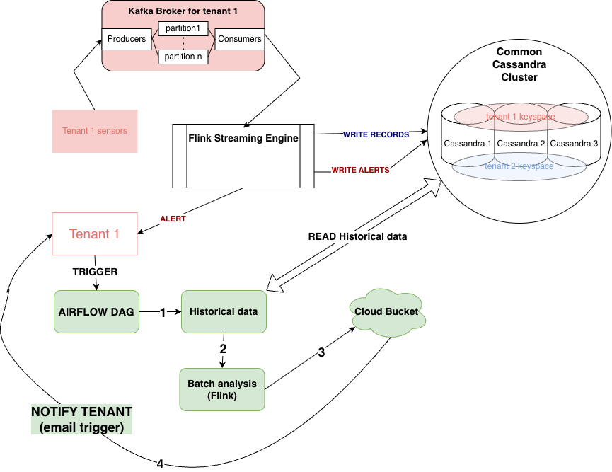

# Assignment 2 Report

**AI Usage Disclosure**:
>I declare that I have not used AI for writing the assignment report\
>I declare that I have used VSCode Copilot for code generation.


## Part 1
### 1.
As the **raw dataset** I select the weather sensor data. The dataset is time-ordered, high-frequency sensor telemetry, which fits the sensor data qualities naturally. 

```Example data:```
|sensor_id|sensor_type|location|lat|lon|timestamp|temperature|humidity|
|---|---|---|---|---|---|---|---|
|36474|DHT22|81266|53.248|-6.124|2025-06-01T00:00:00|13.00|99.90|

The **analytics scenario** is the following: The sensor data comes from an indoor facility - the goal is to detect sudden temperature or humidity anolmalies that may indicate hazardz for the facility, or a sensor defect. Streaming is crutial in this scenario, because analysis is useful only on limited time windows, not after batch processing at the end of the day. To mitigate a risk as soon as possible, the data needs to be processed onine.

The data is suitable for this task because it provides the continuous timestamp observations and temperature and humidity that can be used in real time. Moreover, the data can be partitioned by sensor and time for scalable ingestion and processing.

**streamanalyticsapp** will receive a raw measurement event stream, will analyse data in windows of 15 minutes, with updates every minute. It will compute :
- min temperature / humidity
- max temperature / humidity
- mean temperature / humidity
- median temperature / humidity
- number of missing minutes (to asses sensor functionality)

The output will be an aggregated report record of the following schema:

|sensor_id|sensor_type|location|lat|lon|start_timestamp|end_timestamp|t_min|t_max|t_median|t_avg|h_min|h_max|h_median|h_avg|missing_min|is_alert|
|---|---|---|---|---|---|---|---|---|---|---|---|---|---|---|---|---|
|36474|DHT22|81266|53.248|-6.124|2025-06-01T00:00:00|2025-06-01T00:00:15|13.00|13.00|13.00|13.00|99.90|99.90|99.90|99.90|0|0

The reports will be stored in a database in Cassandra, corresponding to the tenant keyspace. If the event has the field **is_alert** set to 1 (True), a row will be added in the alert table of the tenant. Partitioning will be done by day and hour.


I will be using as testing data a single day of the dht22 sensor data. It can be found in (2025-06-01_dht22.csv)[] **TO DO: ADD PATH HERE**.

### 2.

i) In **streamanalyticsapp**, the data streams should be keyed because:
- **the metrics are dependent on the sensor id**, we should treat differently measurements from different sensors; Doing that enables us to detect failures in sensors and to pinpoint sources of temperature/ humidity abnormalities to a specific location per a time window.
- for scalability reasons, having independent keyed data per sensor makes the system scale organically with the number of sensors

The key would be **sensor_id**. Each tenant would have a different kafka topic, so the data would be implicitly separated by tenant.

ii) The data is sensitive to a single datapoint -> we do not want to lose messages.
However, having duplicates does not necessarily damage the analysis, if it is treated correctly (checking for timestamp duplicates). Since I am using Kafka, the message delivery should satisfy **at-least-once**.

### 3.
i) The actual event time (the moment the sensor produced the measurement) should be associated with stream data for analitics. This makes sure we detect the anomaly in the right timeframe, no matter the delay on the pipeline (for example inside Kafka messaging or Flink processig). The data already has these timestamps associated with it.

ii) I am going to use sliding windows for trend detection. The window length should be 15 minutes, and slide each minute (a new window record is computed every minute, by kicking out latest minute and adding newest minute). The measurements are specified in the first exercise as the report example (min temp, max temp, avg temp, median temp ...).

iii) Out-of-order data could happen because of :
- network lag between sensor and broker
- kafka retries sending message after error occurs
- container or service breaks and restarts, causing a delay in messages sent to that partition
- sensor buffers multiple messages before sending them

iv) Watermarks are needed to accomodate potential out-of-order events. Especially because I am using sliding windows, watermarks are a necessity. Without them, windows may close too early, causing potential data loss. For example, we could wait 3 minutes for out-of-order data to appear before finalizing results. This is a decent timeframe, since we excpect messages once per minute. For windows of 15 minutes it is a short delay, but long enough to accomodate any reasonable lag (caused by buffering/ network malfunctions...)

### 4. 
Some key performance metrics are:
- throughput : 
    - number of events processed / second; 
    - I would monitor Kafka topic ingestion rate and Flink processing rate with the help of built-in metrics (numRecordsInPerSecond, numRecordsOutPerSecond)
    - it is important because through it a system administrator can evaluate performance and scalability, and asses if the pipeline works as expected under heavier loads
- end-to-end latency: 
    - time between event timestamp (when sensor generates message) and result is produced (15min window report sent to the database)
    - it will be tracked in the code of the system: when a window aggregated message is ready we measure processing timestamp (the final time), and substract from it the event time in the raw data record
    - it is relevant for real time anomaly detection - we can see how much time an event spends inside the pipeline and address potential performance issues; 
- processing delay:
    - time inside Flink processing system (from ingestion to result)
    - I can use Flink internal metrics
    - helps identify slow operations and bottlenecks
- missin data rate:
    - proportion of actual datapoints inside a window to the expected datapoints (number of messages / 15 - because we expect 15 messages)
    - we get them by counting number of different events that were received in the window
    - detect sensor failures, useful for tenants to manage their sensors inside their facilities
- duplicate event rate
    - how many duplicates we have per total number of messages in a window
    - detect via the key (sensor_id, timestamp) inside Flink
    - important for ensuring correct analysis


### 5.


**Ingestion** is being done with Kafka. The system design is mostly the same as in assignment 2. Kafka will ingest CSV files and transform them into event messages. There will be one topic per tenant and the partitioning key will be sensor_id.

Why Kafka? High throughput, fault tolerant, supports at-least-once delivery... Reasons explained in detail in previous assignment.

The streaming engine chosen for **streamanalyticsapp** is Apache Flink. It will process timed events in sliding windows, aggregate results and form reports. Reports are always sent to Cassandra to the reports table. Alerts are also always sent to Cassandra to the alerts table. Alerts can also be instantly forwarded to the tenant thorugh a http message service, for example.

Why Flink? It has built-in support for timed events, watermarks and sliding windows. It also provides a low-latency processing.

The **mysimbdp-coredms** remains Cassandra, same system design as in previous assignments. It will store data in two tables / tenant keyspace / sensor type (dht22):
- aggregated window results
- alerts


## PART 2.


#### 1. 

The same Kafka messaging system as in the previous assignments is used. The dedicated producer script, kafka_csv_producer.py:7 **TODO ADD REF**, reads the CSV row by row, validates the input schema, converts each row to JSON, and publishes it to Kafka.

i) Raw sensor data comes from the DHT22 CSV file 2025-06-01_dht22.csv. **TODO ADD REFERENCE**

**INPUT DATA EXAMPLE:**
|sensor_id|sensor_type|location|lat|lon|start_timestamp|end_timestamp|t_min|t_max|t_median|t_avg|h_min|h_max|h_median|h_avg|missing_min|is_alert|
|---|---|---|---|---|---|---|---|---|---|---|---|---|---|---|---|---|
|36474|DHT22|81266|53.248|-6.124|2025-06-01T00:00:00|2025-06-01T00:00:15|13.00|13.00|13.00|13.00|99.90|99.90|99.90|99.90|0|0

**OUTPUT DATA** is inserted in a table of the following format:

```sql
CREATE TABLE IF NOT EXISTS stream_analytics_results (
                day text,
                hour int,
                sensor_id int,
                window_start timestamp,
                tenant_id text,
                sensor_type text,
                location text,
                lat float,
                lon float,
                window_end timestamp,
                t_min float,
                t_max float,
                t_median float,
                t_avg float,
                h_min float,
                h_max float,
                h_median float,
                h_avg float,
                missing_min int,
                is_alert boolean,
                records_in_window int,
                PRIMARY KEY ((day, hour), sensor_id, window_start)
            )
```

**Why enforce both schemas**:

- Input schema enforcement protects event-time processing from malformed rows (missing `timestamp`, non-numeric metrics, etc.).
- Output schema enforcement gives a stable contract for tenant-side consumers (dashboard/alert endpoint).
- Without strict schemas, window computations can mix bad values and produce unreliable alerts.

ii) The kafka producer uses:
- sensor_id as the Kafka key
- a JSON object as the Kafka value

The JSON object is expected by the **streamanalyticsapp** in the following format:
```JSON
{sensor_id, sensor_type, location, lat, lon, timestamp, temperature, humidity}
```
Then, the **streamanalyticsapp** converts types into int/float/string/time. Then returns normalized EventTuple for Flink processing.

```py
# Input event tuple schema:
# (sensor_id, sensor_type, location, lat, lon, event_ts_ms, temperature, humidity)
EventTuple = Tuple[int, str, str, float, float, int, float, float]
```

After flink processing, the new JSON will look like the **OUTPUT DATA FORMAT** (example in previous point i)).

iii) The logic is implemented inside **AnalyticsWindowFunction** in **streamanalyticsapp**. Here there re received keyed windows of EventTuples.

From a window of EventTuples:
- extract static sensor data from first record (sensor_id, sensor_type, lat, lon)
- build temperature and humidity arrays
- compute min/max/avg/median for the measurements
-build alerts for missing data / threshold breaches
- emit a compact JSON result (example below)

```py
result = {
            "tenant_id": self.tenant_id,
            "sensor_id": sensor_id,
            "sensor_type": sensor_type,
            "location": location,
            "lat": lat,
            "lon": lon,
            "window_start": ms_to_iso(context.window().start),
            "window_end": ms_to_iso(context.window().end),
            "t_min": round(t_min, 3),
            "t_max": round(t_max, 3),
            "t_median": round(t_median, 3),
            "t_avg": round(t_avg, 3),
            "h_min": round(h_min, 3),
            "h_max": round(h_max, 3),
            "h_median": round(h_median, 3),
            "h_avg": round(h_avg, 3),
            "missing_min": missing_min,
            "is_alert": bool(is_alert),
            "records_in_window": len(records),
        }
```

Configurable thresholds:

- `TEMP_ALERT_LOW`, `TEMP_ALERT_HIGH`, `HUM_ALERT_LOW`, `HUM_ALERT_HIGH` are runtime environment variables.

iv) 
The callback is sent where there is an alert (is_alert flag is true). An alert appears when:
- the temperature/humidity aggregated values are not in required parameters (set previously by the tenant)
- there are missing messages

The tenant provides a HTTP address (**callback_url**), where the results are sent via HTTP POST to the tenant:
```py
req = request.Request(
        self.callback_url,
        data=payload.encode("utf-8"),
        headers={"Content-Type": "application/json"},
        method="POST",
    )
```

<!-- It can be bounded with MAX_EVENTS for repeatable tests, and it skips malformed rows instead of failing the whole run. -->
<!-- The core parsing logic is in kafka_csv_producer.py:32 and the Kafka send logic is in kafka_csv_producer.py:67. -->

### 2. 
The test environment I created for streamanalyticsapp is a single-tenant tenant2 setup that emulates a streaming pipeline end to end.

I emulate streaming data by replaying a static CSV as timed Kafka events. To control emulation i can use the following parameters:
- EMIT_DELAY_MS : make live ingestion faster or slower 
- MAX_EVENTS : bounds test event number

The flow is:
- -> Input CSV file
- -> Emulated Ingestion (Kafka Messaging System)
- -> Streaming Engine/ Stream Analytics App (Flink)
    - -> Optional alerts sent live to tenant (callbacks via HTTP)
    - -> Analytics results inserted in Cassandra database (table name: *stream_analytics_results*)
    - -> Alerts inserted in Cassandra database (table name: *stream_analytics_alerts*)

What Flink does here:
- it recieves events
- it handles out-of-order events via watermark strategy with bounded out-of-orderness controlled by parameter OUT_OF_ORDER_MINUTES
- it groups events by sensor id
- applies a sliding window to events (15min, sliding every minute)
- computes analytics in each window
- computes output and sends it to appropriate sink

The environment is defined in Docker Compose for a single tenant pipeline (same as in previous assignments):
- ZooKeeper: zookeeper-tenant2
- Kafka broker: kafka-tenant2
- Kafka topic initialization: kafka-topic-init-tenant2
- Cassandra nodes: cassandra1, cassandra2, cassandra3
- Cassandra keyspace initialization:
    - cassandra-init-tenant2

Kafka is configured so the app can talk to it both inside Docker and from the host machine:
- internal listener: kafka-tenant2:29092
- host listener: localhost:9094

<!-- The relevant Kafka listener config is in docker-compose.yml:30 and docker-compose.yml:31. -->

Cassandra is configured to use the tenant2 keyspace **mysimbdp_tenant2**, which is also the default in the **streamanalyticsapp**.
The app also reads Cassandra hosts from CASSANDRA_HOSTS, with the default host being 127.0.0.1.


### 3.
#### Scenario A: "increasing/varying the speed of streaming data" - `MAX_EVENTS=1000`

| Test | Config : `EMIT_DELAY_MS` |  
|------|--------|
| **A1** | Burst (0ms delay) | 
| **A2** | Realistic (100ms) | 
| **A3** | Slow (1000ms) |

---
#### Scenario B: "changing window function parameters"

| Test | Config : Window size / Window slide| Usecase |
|------|--------|--------|
| **B1** | 5m/30s| Very responsive alerts (high write) |
| **B2** | 15m/1m| Default (balance) |
| **B3** | 30m/5m| Long term analysis (minimal write)|
| **B4** | 15m/10s| Near-real-time monitoring / Stresstest (extremely high write)
---
### Results
`Disclaimer:`
- The tests in this section have been run on parallelism set to 1 -> so no parallelism.

#### A (speed variation)

| Scenario | Produced | Skipped | Producer Time (s) | Producer Rate (ev/s) | Kafka Consumed | Kafka Consume Time (s) | Kafka Consume Rate (ev/s) | Windows | Cassandra Rows |
|--|--:|--:|--:|--:|--:|--:|--:|--:|--:|
| A1_burst | 999 | 1 | 0.05 | 21829.74 | 999 | 30.38 | 32.89 | 14600 | 13650 | 
| A2_moderate | 999 | 1 | 103.60 | 9.64 | 1000 | 3.21 | 311.40 | 14600 | 13650 | 
| A3_slow | 599 | 1 | 601.16 | 1.00 | 600 | 3.18 | 188.59 | 8900 | 8316 | 

---
`Interpretation:`

- Producer behavior follows expected speed control: A1 is burst, A2 is realistic, and A3 is slow streaming.
- One record is skipped each time because it has the field humidity missing (see log extract below)


```sh
WARN row 504 skipped: missing or empty column: humidity
```
<!-- - All rerun A scenarios now produce non-zero windows and Cassandra rows, confirming end-to-end Flink processing and persistence. -->
<!-- - With the same window configuration, output amplification remains stable across ingestion speeds (about 14.6x to 14.9x), while total pipeline time drops from A1 to A3 as event volume/arrival pressure decreases. -->
<!-- - A2 shows consumed = produced + 1, indicating a minor offset/group boundary effect in replay-style tests. -->


---

- **Producer-Side Behavior**
    - The producer speed control is working exactly as designed. T

    - A1_burst (0ms delay): Completes in just 0.05 seconds at 21,829 events/sec. All 999 events are emitted in a burst.
    - A2_moderate (100ms delay): Takes 103.6 seconds at 9.64 events/sec — controlled realistic streaming pace with ~100ms between each event.
    - A3_slow (1000ms delay): Takes 601.16 seconds at 1.00 event/sec — slowest ingestion, one event per second.
    - This range in producer rate (21,829 -> 1) demonstrates the full spectrum from burst conditions to real-time monitoring.
<!-- 
**Kafka Consumption Dynamics**
The most striking finding is decoupling between producer and consumer:

A1_burst: Consumes in 30.38s at 32.89 events/sec — Kafka buffers the fast burst and Flink consumes steadily.
A2_moderate: Consumes in 3.21s at 311.40 events/sec — Kafka releases a backlog rapidly to Flink; consume rate is 32x faster than producer rate.
A3_slow: Consumes in 3.18s at 188.59 events/sec — Again, Flink pulls a buffered batch quickly.
Key insight: Kafka decouples ingestion timing from consumption; Flink consumes events in batches after they're available, not in real-time lock-step with the producer. -->

- **Flink Window Processing & Persistence**
    - All A tests produce windows and insert Cassandra rows, confirming end-to-end success.

    - A1 and A2: emit 14,600 windows -> 13,650 Cassandra rows (93% persistence rate)

    - Same window config (default 15m/60s) produces identical output despite producer speed difference. This shows window logic is event-time-based, not wall-clock-based.
    A3: Emits 8,900 windows -> 8,316 rows (same 93% rate)

    - A3 has lower counts due to fewer input events (599 vs 999).
    Proportional: 8316/8900 = 93.3% exactly matches A1/A2 persistence.

    - `Critical observation: Window output is deterministic and data-driven, independent of temporal speed.`

<!-- - **Pipeline End-to-End Time**
    - Total pipeline duration (producer start to Flink completion) inversely correlates with producer speed.

    - A1_burst: 100.24s total (producer: 0.05s + Flink: ~100s) — Flink's streaming engine has to continuously process incoming events at high velocity. It triggers windows, aggregates, writes to Cassandra — all while events are still arriving. This creates back-pressure and long processing chains.

    - A2_moderate: 73.18s total — Moderate speed leads to moderate total time

    - A3_slow: 47.59s total (producer: 601s + Flink: negligible) — Counterintuitive: slowest producer yields fastest end-to-end time
    This is because A3_slow's timeline is dominated by the 601-second producer phase, but once events hit Kafka, Flink processes them in ~3 seconds. A1_burst forces Flink through 100+ seconds of streaming computation with a high event rate. -->

**Amplification Factor**
Amplification (windows/consumed) is stable. 

`It essentially means if data is inflated. In this test scenario it is expected to be about 15x inflated, because there is about 1 record/sensor/15 minutes in the selected extract from the dataset. And the window is of 15 minutes with a 1 min sliding window. So the same record is replicated 15 times.`

A1: 14600 / 999 ≈ 14.62x

A2: 14600 / 1000 ≈ 14.60x

A3: 8900 / 600 ≈ 14.83x

`Conclusions:`

- Window counts and Cassandra persistence are reproducible across vastly different speeds.
- The system is robust to producer timing variations.
- This validates the pipeline's suitability for both real-time (low-latency) and batch-replay (fast) workloads.
---
#### B (window parameter variation)

| Scenario | Window Config | Produced | Skipped | Producer Rate (ev/s) | Kafka Consumed | Kafka Consume Rate (ev/s) | Windows | Cassandra Rows | Avg Write (ms) | Amplification | Pipeline Time (s) |
|--|--|--:|--:|--:|--:|--:|--:|--:|--:|--:|--:|
| B1_small_windows | 5m/30s | 999 | 1 | 18.64 | 1000 | 312.40 | 9764 | 9764 | 3.95 | 9.76x | 64.41 |
| B2_baseline_windows | 15m/1m | 999 | 1 | 18.61 | 999 | 32.90 | 14625 | 14625 | 3.45 | 14.64x | 113.38 |
| B3_large_windows | 30m/5m | 999 | 1 | 18.28 | 1000 | 312.61 | 5850 | 5850 | 3.28 | 5.85x | 37.42 |
| B4_high_frequency | 15m/10s | 999 | 1 | 17.64 | 1000 | 312.01 | 87795 | 87795 | 3.48 | 87.80x | 477.39 |
---
`Interpretation:`

- Window-slide tuning has a massive effect on output volume: B4 (15m/10s) creates 87795 rows, while B3 (30m/5m) creates only 5850 rows.
- Amplification ranking is B4 (87.80x) > B2 (14.64x) > B1 (9.76x) > B3 (5.85x).
- Pipeline time strongly follows write amplification: B4 is the slowest (477.39s), B3 is the fastest (37.42s).
- Average Cassandra write latency stays in a similar range across B scenarios (3.28 to 3.95 ms), so total runtime differences are primarily driven by number of writes, not per-write slowdown.


---

All B tests maintain nearly identical producer characteristics:

- B1–B4 producer rates: 17.64–18.64 events/sec (steady ~50ms delay between events).

- All produce 999 events.

- All skipped exactly 1 malformed row.

- This validates that producer behavior is isolated from window configuration — only the Flink streaming engine side varies.


- **Window Amplification**

This is where window configuration produces dramatic differences:
The observerd formula: Amplification = (window_size / window_slide). Amplification (is also defined in the A tests analysis) means how many records are inserted compared to how many records were ingested.

    - B3: (30m / 5m) = 6 -> actual 5.85x 
    - B1: (5m / 30s) = 10 -> actual 9.76x 
    - B2: (15m / 1m) = 15 -> actual 14.64x 
    - B4: (15m / 10s) = 90 -> actual 87.80x 
     B4 is extreme: A 10-second slide across a 15-minute window means nearly 90 overlapping windows per event, producing 88x more output rows than input events. This is the "high-frequency monitoring stresstest" mode intended for ultra-responsive alerting.

- **Cassandra Write Latency**

Average write latencies are remarkably consistent.

Despite B4 writing 15x more rows than B3, per-write latency stays in 3.2–3.95 ms range. This indicates:

- Cassandra batching is effective
- Network/database round-trip is the bottleneck, not write complexity

**Pipeline End-to-End Time**:

Total pipeline time strongly correlates with output volume:

This is purely I/O bound: the system must serialize, send, and persist 15x more data in B4 vs B3. At 3.4 ms per write and 87,795 writes, the math works: 87,795 × 3.5 ms ≈ 307 seconds of write time alone (remaining time is Kafka processing, window triggering, and network latency).

**Perfect Persistence: 100% Success Rate**
All B tests show cassandra_rows = windows_emitted (100% write success).

Unlike A tests (which had ~93% success), B scenarios had zero write failures. This suggests healthier Cassandra availability during B runs or reduced contention at lower write rates.

Conclusions:
B scenarios prove that window configuration is the primary lever for tuning pipeline behavior.

- Small slides = high amplification -> More alerting sensitivity, lower latency per decision, higher write load.

- Large slides = low amplification -> Batch-friendly, minimal storage, slower response time
- Write latency is stable -> Cassandra can handle 87k+ writes; total time scales linearly with volume

The throughput range (B3->B4) demonstrates the system can adapt from report generation (low-frequency) to high-frequency streaming dashboards by tuning parameters.


### 4.

(i) How erroneous data is emulated in tests

I emulate erroneous source records directly in the input stream by replaying CSV rows through the Kafka producer. In the current runs, the dataset contains at least one malformed row with a missing humidity field, and the producer logs it as skipped. This is visible in the producer output behavior and metrics where each scenario reports Skipped = 1.

This is a valid fault-injection method because the error is injected at the same place real faults occur: in the raw sensor-source data before Kafka serialization.

(ii) Test design


(iii) How implementation deals with erroneous data

**Source-level malformed records:**

The producer validates required fields and types before publish. Invalid rows raise ValueError, are logged as warnings, counted in skipped, and the producer continues. This makes sure that a failure does not terminate the ingestion.

**Kafka-to-Flink malformed records:**

The stream app validates incoming record fields in *parse_kafka_record*. Invalid messages are skipped with warning and processing continues; the consumer is not terminated.

**Sink/write exceptions:**

Cassandra write operations are wrapped in exception handling. When a failure is encountered, the app increments cassandra_writes_failed, logs warnings, and continues processing next records. Callback failures are also caught and logged without stopping the pipeline.


`Observed behavior from your measured runs:`

**Malformed source row handling:**

Each main scenario shows Skipped = 1, confirming bad-row filtering without pipeline crash.

**Resilience under sink failures:**
In A runs, there are hundreds of Cassandra write failures, yet windows and rows are still produced, showing resilience.

```bash
2026-04-06T20:39:25Z WARN cassandra write failed: ('Unable to complete the operation against any hosts', {<Host: 127.0.0.1:9042 DC1>: Unavailable('Error from server: code=1000 [Unavailable exception] message="Cannot achieve consistency level LOCAL_ONE" info={\'consistency\': \'LOCAL_ONE\', \'required_replicas\': 1, \'alive_replicas\': 0}')})
```

**Performance impact:**
A scenarios with many sink failures (in the A tests) show lower persistence and longer and less stable pipeline behavior versus B scenarios where Cassandra write failures are zero and throughput is cleaner.

In conclusion, the implementation is robust. It rejects bad source records early, tolerates malformed consumed records, and survives sink/callback exceptions with degraded output quality/performance rather than full job failure.


### 5.
Factors and parameters affecting parallelism in the test environment and in streamanalyticsapp:

Primary:
- Flink job parallelism (`PARALLELISM`): controls number of operator subtasks (`env.set_parallelism(PARALLELISM)`).

Secondary:
- Number of source records and replay speed (`MAX_EVENTS`, `EMIT_DELAY_MS`): determines backlog pressure and whether more subtasks can be kept busy.
- Window configuration (`WINDOW_SIZE_MINUTES`, `WINDOW_SLIDE_SECONDS`): changes amplification and sink load; frequent slides produce many more outputs.
- Key distribution (`sensor_id`): keyed window operators parallelize only if keys are sufficiently distributed; skew can reduce effective parallelism.

**Parallelism test design:**

- Scenario kept fixed: `A2_moderate` (same dataset, `MAX_EVENTS=1000`, `EMIT_DELAY_MS=100`, same window config 15m/60s).
- Only one variable changed: `PARALLELISM` set to 1, 2, 4, 8.
- Metrics captured from generated JSON files (`A2_moderate_p1_metrics.json`, `A2_moderate_p2_metrics.json`, `A2_moderate_p4_metrics.json`, `A2_moderate_p8_metrics.json`).

**Measured performance (A2_moderate with different parallelism):**

| Parallelism | Produced | Kafka Consumed | Kafka Consume Rate (ev/s) | Windows | Cassandra Rows | Cassandra Write Failures | Pipeline Time (s) |
|--:|--:|--:|--:|--:|--:|--:|--:|
| 1 | 999 | 999 | 32.90 | 14625 | 975 | 13650 | 88.72 |
| 2 | 999 | 1000 | 314.58 | 14625 | 975 | 13650 | 36.98 |
| 4 | 999 | 1000 | 314.63 | 14625 | 975 | 13650 | 30.48 |
| 8 | 999 | 1000 | 311.28 | 14625 | 975 | 13650 | 26.39 |

Observed issues in the environment during these tests:

- Flink logs repeatedly show Cassandra write failures (`LOCAL_ONE` unavailable / `alive_replicas=0` and host-down connection errors).
- Because of this sink instability, only 975 rows were persisted although 14625 window outputs were emitted.

---

Observations:

- the biggest gain is from 1 -> 2; gains from 4 -> 8 are smaller, showing overhead/other bottlenecks.
- higher parallelism increases concurrent write attempts; because Cassandra is unstable, this can amplify failures rather than improve successful throughput.

`Conclusion for this test environment:`

- Increasing parallelism clearly improved processing speed.
- In this setup, `PARALLELISM=4` to `8` gave the best runtime, but with less improvement.
- The biggest issue was not Flink compute saturation, but Cassandra availability; observing such sink instability, very high parallelism may increase pressure and error volume.
- For reliable benchmarking, sink health must be stabilized first; then parallelism can be tuned.

## Part 3
### 1.
To integrate an external RESTful microservice I would extend streamanalyticsapp with an additional processing stage.

I would introduce an asynchronous step:
- Flink Async I/O calls the REST service
- sends a batch of aggregated records
- receive ML predictions
- add ML results to record before writing it to Cassandra

Flink Async I/O allows the Flink application to interact with the microservice asynchronously, overcoming the latency bottleneck of waiting for a response. It is a native tool that fits the task and the current pipeline architecture.

**The tenant** must provide the ML microservice and define input/output schema. It must give an authentication API key.

### 2.
The solution for this scenario is a Dead Letter Queue (DLQ). In my current design there is a table of alerts inside Cassandra database that holds the erroneous records. However, some records are skipped already by Kafka, if they are malformed (have missing fields). There should also be added a table of invalid records. 

### 3.



To achieve this I would use a system such as Apache Airflow to manage execution, dependencies and fault tolerance.

The process has the following steps:
- tenant recieves streaming results (eg. HTTP callback from the streamanalyticsapp)
- tenant evaluates results
- when it detects a critical condition, tenant triggers Airflow DAG via a REST API call

The workflow has the following steps:
- task extracts historical data from Cassandra (eg. all analytics results of sensor over last 30 days)
- task performs batch analytics (eg with Spark/ Flink). It can perform trend detection, anommaly clustering, predictive modelling ...
- results are stored in cloud storage system (eg. gcloud bucket)
- once the workflow is complete, tenant receives email noification that results are ready to be accessed

Using a workflow engine provides several important benefits:
- `fault tolerance` - via retries and task-level error handling
- `observability` - via logs and execution tracking
- `scalability` - by allowing independent scaling of batch jobs. - `task dependencies` - ensures that, for example, notifications are only sent after successful completion of the batch analysis

### 4.
In the current design, running streamanalyticsapp with a new schema may fail at runtime or produce erroneous results. To prevent this, I could employ a **Confluent Schema Registry** integrated with Kafka. 

Instead of sending raw JSON, producers would serialize messages unsing schema-aware formats such as JSON Schema, registering each schema in the version registry.
The registry enforces compatibility rules (e.g., backward or forward compatibility), ensuring that schema changes do not break existing consumers.

On the consumer side, the streamanalyticsapp should validate the schema version of incoming messages against an expected version (or range of compatible versions) before processing them. If an unknown or incompatible schema is detected, the application can reject the message (e.g., redirect it to a dead-letter queue).

Additionally, the developer/owner of the streamanalyticsapp can detect schema changes proactively through CI/CD integration with the schema registry, where any new schema registration triggers validation checks and alerts. This ensures that schema updates are reviewed and the streaming application is updated accordingly before deployment.


### 5.
The current design supports fully end-to-end exactly once, because:
- Kafka supports exactly-once (idempotent producers + transactions)
- Flink supports exactly-once processing (through checkpoints)
- Cassandra does not support exactly-once writes **BUT** the primary key ((day, hour), sensor_id, window_start) is deterministic, and any duplicated records would be overwritten, not duplicated.


