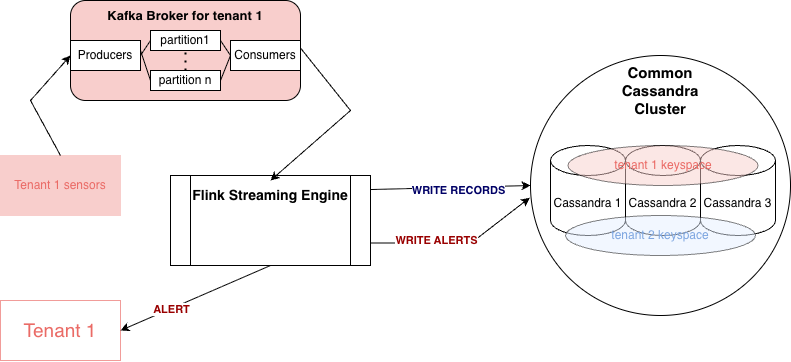

# Assignment 2 Report

**AI Usage Disclosure**:
>I declare that I have not used AI for writing the assignment report\
>I declare that I have used VSCode Copilot for code generation.


## Part 1
### 1.
As the **raw dataset** I select the weather sensor data. The dataset is time-ordered, high-frequency sensor telemetry, which fits the sensor data qualities naturally. 

```Example data:```
|sensor_id|sensor_type|location|lat|lon|timestamp|temperature|humidity|
|---|---|---|---|---|---|---|---|
|36474|DHT22|81266|53.248|-6.124|2025-06-01T00:00:00|13.00|99.90|

The **analytics scenario** is the following: The sensor data comes from an indoor facility - the goal is to detect sudden temperature or humidity anolmalies that may indicate hazardz for the facility, or a sensor defect. Streaming is crutial in this scenario, because analysis is useful only on limited time windows, not after batch processing at the end of the day. To mitigate a risk as soon as possible, the data needs to be processed onine.

The data is suitable for this task because it provides the continuous timestamp observations and temperature and humidity that can be used in real time. Moreover, the data can be partitioned by sensor and time for scalable ingestion and processing.

**streamanalyticsapp** will receive a raw measurement event stream, will analyse data in windows of 15 minutes, with updates every minute. It will compute :
- min temperature / humidity
- max temperature / humidity
- mean temperature / humidity
- median temperature / humidity
- number of missing minutes (to asses sensor functionality)
The output will be an aggregated report record of the following schema:

|sensor_id|sensor_type|location|lat|lon|start_timestamp|end_timestamp|t_min|t_max|t_median|t_avg|h_min|h_max|h_median|h_avg|missing_min|is_alert|
|---|---|---|---|---|---|---|---|---|---|---|---|---|---|---|---|---|
|36474|DHT22|81266|53.248|-6.124|2025-06-01T00:00:00|2025-06-01T00:00:15|13.00|13.00|13.00|13.00|99.90|99.90|99.90|99.90|0|0

The reports will be stored in a database in Cassandra, corresponding to the tenant keyspace. If the event has the field **is_alert** set to 1 (True), a row will be added in the alert table of the tenant. Partitioning will be done by day and hour.


I will be using as testing data a single day of the dht22 sensor data. It can be found in (2025-06-01_dht22.csv)[] **TO DO: ADD PATH HERE**.

### 2.

i) In **streamanalyticsapp**, the data streams should be keyed because:
- **the metrics are dependent on the sensor id**, we should treat differently measurements from different sensors; Doing that enables us to detect failures in sensors and to pinpoint sources of temperature/ humidity abnormalities to a specific location per a time window.
- for scalability reasons, having independent keyed data per sensor makes the system scale organically with the number of sensors

The key would be **sensor_id**. Each tenant would have a different kafka topic, so the data would be implicitly separated by tenant.

ii) The data is sensitive to a single datapoint -> we do not want to lose messages.
However, having duplicates does not necessarily damage the analysis, if it is treated correctly (checking for timestamp duplicates). Since I am using Kafka, the message delivery should satisfy **at-least-once**.

### 3.
i) The actual event time (the moment the sensor produced the measurement) should be associated with stream data for analitics. This makes sure we detect the anomaly in the right timeframe, no matter the delay on the pipeline (for example inside Kafka messaging or Flink processig). The data already has these timestamps associated with it.

ii) I am going to use sliding windows for trend detection. The window length should be 15 minutes, and slide each minute (a new window record is computed every minute, by kicking out latest minute and adding newest minute). The measurements are specified in the first exercise as the report example (min temp, max temp, avg temp, median temp ...).

iii) Out-of-order data could happen because of :
- network lag between sensor and broker
- kafka retries sending message after error occurs
- container or service breaks and restarts, causing a delay in messages sent to that partition
- sensor buffers multiple messages before sending them

iv) Watermarks are needed to accomodate potential out-of-order events. Especially because I am using sliding windows, watermarks are a necessity. Without them, windows may close too early, causing potential data loss. For example, we could wait 3 minutes for out-of-order data to appear before finalizing results. This is a decent timeframe, since we excpect messages once per minute. For windows of 15 minutes it is a short delay, but long enough to accomodate any reasonable lag (caused by buffering/ network malfunctions...)

### 4. 
Some key performance metrics are:
- throughput : 
    - number of events processed / second; 
    - I would monitor Kafka topic ingestion rate and Flink processing rate with the help of built-in metrics (numRecordsInPerSecond, numRecordsOutPerSecond)
    - it is important because through it a system administrator can evaluate performance and scalability, and asses if the pipeline works as expected under heavier loads
- end-to-end latency: 
    - time between event timestamp (when sensor generates message) and result is produced (15min window report sent to the database)
    - it will be tracked in the code of the system: when a window aggregated message is ready we measure processing timestamp (the final time), and substract from it the event time in the raw data record
    - it is relevant for real time anomaly detection - we can see how much time an event spends inside the pipeline and address potential performance issues; 
- processing delay:
    - time inside Flink processing system (from ingestion to result)
    - I can use Flink internal metrics
    - helps identify slow operations and bottlenecks
- missin data rate:
    - proportion of actual datapoints inside a window to the expected datapoints (number of messages / 15 - because we expect 15 messages)
    - we get them by counting number of different events that were received in the window
    - detect sensor failures, useful for tenants to manage their sensors inside their facilities
- duplicate event rate
    - how many duplicates we have per total number of messages in a window
    - detect via the key (sensor_id, timestamp) inside Flink
    - important for ensuring correct analysis


### 5.


**Ingestion** is being done with Kafka. The system design is mostly the same as in assignment 2. Kafka will ingest CSV files and transform them into event messages. There will be one topic per tenant and the partitioning key will be sensor_id.

Why Kafka? High throughput, fault tolerant, supports at-least-once delivery... Reasons explained in detail in previous assignment.

The streaming engine chosen for **streamanalyticsapp** is Apache Flink. It will process timed events in sliding windows, aggregate results and form reports. Reports are always sent to Cassandra to the reports table. Alerts are also always sent to Cassandra to the alerts table. Alerts can also be instantly forwarded to the tenant thorugh a http message service, for example.

Why Flink? It has built-in support for timed events, watermarks and sliding windows. It also provides a low-latency processing.

The **mysimbdp-coredms** remains Cassandra, same system design as in previous assignments. It will store data in two tables / tenant keyspace / sensor type (dht22):
- aggregated window results
- alerts


## Part 2
### 1.

### 2.

### 3.

### 4.

### 5.


## Part 3
### 1.

### 2.

### 3.

### 4.

### 5.


##### HELLO
# Assignment 3 Report

**AI Usage Disclosure**:
>I declare that I have not used AI for writing the assignment report\
>I declare that I have used VSCode Copilot for code generation.


## Part 1
### 1.
For this implementation I use a **single tenant (tenant2)** and a **single DHT22 file** only:

- `data/tenant2/2025-06-01_dht22.csv`

The stream analytics app is implemented in:

- `code/streamanalyticsapp.py`

The raw input record schema (CSV header) is:

|sensor_id|sensor_type|location|lat|lon|timestamp|temperature|humidity|
|---|---|---|---|---|---|---|---|
|36474|DHT22|81266|53.248|-6.124|2025-06-01T00:00:00|13.00|99.90|

The output analytics record schema (JSON per sliding window result) is:

|tenant_id|sensor_id|sensor_type|location|lat|lon|window_start|window_end|t_min|t_max|t_median|t_avg|h_min|h_max|h_median|h_avg|missing_min|is_alert|records_in_window|
|---|---|---|---|---|---|---|---|---|---|---|---|---|---|---|---|---|---|---|
|tenant2|36474|DHT22|81266|53.248|-6.124|2025-06-01T00:00:00Z|2025-06-01T00:15:00Z|13.0|13.8|13.4|13.41|93.1|99.9|96.4|96.28|0|false|15|

Why enforce both schemas:

- Input schema enforcement protects event-time processing from malformed rows (missing `timestamp`, non-numeric metrics, etc.).
- Output schema enforcement gives a stable contract for tenant-side consumers (dashboard/alert endpoint).
- Without strict schemas, window computations can silently mix bad values and produce unreliable alerts.

### 2.
i) Keying strategy:

- The stream is keyed by `sensor_id` in Flink.
- All calculations in a window are sensor-local, so keying avoids mixing independent sensor timelines.

ii) Delivery semantics for this minimal version:

- Input comes from one CSV source replayed as a stream.
- In this minimal setup we do not implement distributed exactly-once transport; the app focuses on event-time window logic for a single tenant.

### 3.
i) Serialization/deserialization (serde):

- Deserialization: `csv.DictReader` parses `;`-separated rows, then `parse_input_row` converts each field to strongly typed values.
- Event-time parsing: `timestamp` is parsed with `%Y-%m-%dT%H:%M:%S` and converted to Unix milliseconds.
- Serialization of results: each window result is serialized as compact JSON and emitted to stdout (and optional HTTP callback).

ii) Processing logic in `streamanalyticsapp.py`:

- Read one input file as a stream source (`CSVSource`).
- Assign watermarks with bounded out-of-orderness (default 3 minutes).
- `key_by(sensor_id)`.
- Apply a **15-minute sliding window** with **1-minute slide**.
- In `AnalyticsWindowFunction`, compute:
    - `t_min`, `t_max`, `t_avg`, `t_median`
    - `h_min`, `h_max`, `h_avg`, `h_median`
    - `missing_min = max(0, 15 - unique_minutes_in_window)`
    - `is_alert` based on threshold violation or missing minutes.

iii) Event-time correctness:

- Window boundaries use sensor event time, not processing time.
- This keeps results correct even if data arrives late within the watermark bound.

iv) Configurable thresholds:

- `TEMP_ALERT_LOW`, `TEMP_ALERT_HIGH`, `HUM_ALERT_LOW`, `HUM_ALERT_HIGH` are runtime environment variables.

### 4. 
Near real-time result delivery in this implementation:

- Default mode: each finished window result is printed immediately as JSON line.
- Push mode: if `TENANT_CALLBACK_URL` is set, the same JSON payload is sent via HTTP `POST` in the sink function.
- Results are produced near real time when:
  - watermarks pass window end (`OUT_OF_ORDER_MINUTES` controls the lateness buffer), and
  - the job keeps running continuously.

In other words, output delay is approximately: watermark lateness + processing overhead.


### 5.


Implementation scope (minimal, non-generalized by design):

- Single tenant only (`tenant2`).
- Single data source only (`2025-06-01_dht22.csv`).
- Single Flink app only (`code/streamanalyticsapp.py`).
- Minimal run guide in `code/auxx/how_to_run_streamanalyticsapp.txt`.

This keeps code volume low while still implementing event-time stream analytics with schemas, serde, windowed computation, and near-real-time output delivery.


## Part 2
### 1.

### 2.

### 3.

### 4.

### 5.


## Part 3
### 1.

### 2.

### 3.

### 4.

### 5.